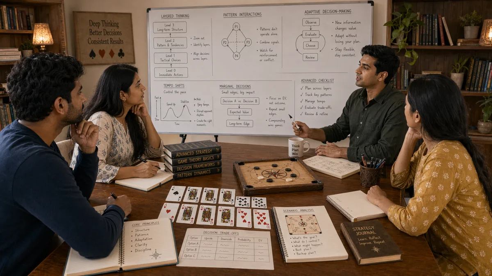

# Advanced Concepts in Desi Game Strategy

## 🪶 Introduction

Moving beyond basic strategy into advanced concepts requires deeper understanding of game theory, opponent exploitation, and the subtle elements that separate excellent players from good ones. These advanced ideas build on fundamentals and strategic thinking to create a more nuanced, precise approach to decision-making in traditional South Asian games.

Advanced concepts are not just about complexity for its own sake. They are about finding edges that simpler approaches miss. When you understand why basic strategy works, you can modify it intelligently to exploit specific situations. When you understand game theory, you can balance your play in ways that are harder to exploit. These abilities create advantages that compound over time.

This guide covers the key advanced concepts that skilled players use to maintain edge. These require more mental effort than basic strategy, but they are learnable with dedicated practice and honest review. The goal is not to memorize formulas but to internalize principles that inform better decisions in actual games.

---

## 🖼️ Advanced Concepts Overview

---

## 🎯 What Are Advanced Concepts?

Advanced concepts in desi game strategy refer to strategic and tactical techniques that go beyond standard fundamental play. They involve deeper understanding of game theory, more nuanced opponent exploitation, and subtle elements like image management, leverage, and mixed strategy. These concepts require comfortable mastery of basics before they can be applied effectively.

Advanced concepts are contextual. What is advanced in one situation might be basic in another. A beginner might find pot odds calculation advanced, while an expert might consider that fundamental. The distinction is relative to player skill level and the complexity of the situation.

The value of advanced concepts is precision. They provide frameworks for making better decisions in complex situations where basic approaches might be unclear. They also create options for exploiting specific opponent weaknesses that general strategy cannot address.

---

# 🧠 1. Game Theory Equilibrium and Optimal Play

Game theory equilibrium represents a set of strategies where no player can improve by unilaterally changing their approach. In games with incomplete information, equilibrium strategies balance between multiple lines in ways that prevent exploitation. Understanding equilibrium helps you avoid being exploited while also recognizing when opponents are playing non-optimal strategies that you can attack.

Equilibrium does not mean predictable. Equilibrium strategies often include randomization between multiple options, which creates uncertainty for opponents. The key is that the randomization follows optimal frequencies based on game theory calculations, not arbitrary or emotional choices.

Applying equilibrium thinking involves recognizing when your current strategy is exploitable and adjusting to make it less so. This does not mean always playing equilibrium—against weak opponents, exploitative play is often more profitable. But equilibrium provides a baseline that ensures you are never being taken advantage of.

---

# 🧠 2. Mixed Strategy and Randomization

When you always play the same way in a given situation, observant opponents will notice and exploit you. Mixed strategy involves varying your actions in ways that make you less predictable while still serving your strategic goals. The randomization must be deliberate and based on sound reasoning, not arbitrary or emotional.

In practice, mixed strategy might mean sometimes checking with hands you would normally bet, sometimes betting with hands you would normally check, or varying your bet sizes based on game theory optimal frequencies. The goal is to keep opponents from forming reliable conclusions about your holdings or tendencies.

Effective randomization requires understanding which decisions most need protection from exploitation. Actions that are obviously optimal if always played—like always betting nuts—need mixing more than marginal decisions. Prioritizing randomization where it matters most prevents becoming readable without wasting mental energy on less important decisions.

---

# 🧠 3. Deep Opponent Modeling and Range Reading

Beyond simple tendency tracking, deep opponent modeling involves building detailed mental representations of how specific opponents think, what they are likely to do in various situations, and how their strategy might evolve. This detailed understanding enables precise exploitation that general reads cannot provide.

Range reading is part of deep modeling. Instead of putting opponents on specific hands, you consider ranges of possible holdings and evaluate how your decisions perform against those ranges. This probabilistic thinking leads to more robust decisions that perform well across many possible opponent hands.

Deep modeling requires extensive observation and good memory for details. You track not just what opponents do but why they do it, how their decisions change based on board texture, position, and stakes. Building this detailed understanding takes time but creates significant advantage against opponents who have not done the same work.

---

# 🧠 4. Leverage and Pressure Point Identification

Advanced players identify leverage points—situations where they can apply disproportionate pressure relative to the actual strength of their position. This leverage might come from position, stack size, opponent tendencies, or board texture. Recognizing and creating leverage is an advanced skill that multiplies the effectiveness of your actions.

Pressure points exist where opponents face difficult decisions that they are likely to get wrong. Identifying where these points occur and engineering situations that force opponents into them is a hallmark of advanced strategic play. This requires understanding opponent weaknesses and having the patience to set up favorable situations.

Creating leverage often involves prior actions that seem unrelated to the current point but are designed to create the current opportunity. A strategic bet earlier in a hand might set up a bluff that works because of how opponent perceives your range. This patient, setup-oriented approach characterizes advanced strategic thinking.

---

# 🧠 5. Counter-Strategy and Adaptive Play Against Skilled Opponents

When playing against opponents who understand strategy themselves, counter-strategy becomes important. These opponents will notice your patterns and try to exploit them. Advanced play involves not just executing your own strategy but anticipating how opponents will try to counter it and planning accordingly.

Counter-strategy requires maintaining awareness of how your play appears to others and whether you are being exploited. If opponents are adjusting to your tendencies, you need to adjust back, creating a strategic arms race where both sides adapt continuously. The player who adapts better usually wins.

Adaptive play against skilled opponents often involves occasionally making " suboptimal" decisions that are designed to prevent future exploitation. If opponents know you never bluff, adding some bluffs to your value-heavy range protects you from being folded out of pots. These protective adaptations sacrifice some immediate value for long-term protection.

---

# 🧠 6. ICM and Tournament Decision Frameworks

In tournament contexts, chip value differs from cash game value because tournament payouts are not linear with chip counts. ICM (Independent Chip Model) provides a framework for evaluating whether specific decisions are correct given the actual dollar value of chips. This changes optimal strategy in ways that cash game thinking misses.

ICM considerations are most important in bubble situations and near payouts, where elimination or qualification creates large changes in actual value. A chip stack that seems large might represent small actual equity because of payout structure, which changes risk tolerance and decision-making.

Advanced tournament play involves calculating or estimating ICM implications quickly enough to make sound decisions under pressure. This requires both understanding the concept and practicing its application until it becomes automatic enough for real-time use.

---

# 🧠 7. Image Management and Table Identity

How opponents perceive you affects how they make decisions against you. Advanced players manage their table image strategically, sometimes playing in ways that create misleading impressions for future exploitation. This image management is a subtle but important advanced concept.

Image management might involve playing a few hands in an unusual way to create an impression, then exploiting that impression later when it serves you. If you play conservatively for a period, opponents will think you are tight and give you credit for strong hands when you bet. This can be used for genuine value or for sophisticated bluffs.

Managing image requires balancing current reputation with future exploitation opportunities. Playing too many unusual hands creates a confusing image that limits your ability to exploit opponent reads. Playing too consistently makes you predictable. The advanced skill is knowing how to create and use image strategically.

---

# 🧠 8. Emotional Control Under Advanced Pressure

At advanced levels, emotional control becomes even more critical because the stakes are often higher and the decisions more complex. Pressure can cause even experienced players to tilt or lose focus, and the ability to maintain emotional equilibrium under these conditions is what separates consistently excellent players from intermittently excellent ones.

Advanced emotional control involves recognizing pressure before it affects decisions and applying techniques to maintain equilibrium. This might mean taking a breath, consciously returning to analytical thinking, or recognizing when fatigue or frustration is distorting judgment and taking a break.

Emotional control at the advanced level also involves using emotional awareness strategically. Understanding your own emotional state and how it might affect decisions helps you compensate appropriately. It also involves reading opponent emotional states and exploiting them when they lead to suboptimal decisions.

---

## ⚠️ Common Mistakes

- **Trying to apply advanced concepts before fundamentals are solid**: Advanced concepts build on basics; attempting them without foundational skill creates confusion and poor play.

- **Playing too many hands while trying to incorporate advanced ideas**: Complexity increases decision load; trying to apply too many advanced concepts at once leads to errors.

- **Forgetting that simple is often better**: Advanced concepts should enhance simple strategies, not replace them. When basics work, use them.

- **Misidentifying equilibrium situations**: Not every situation requires equilibrium play; using balanced strategies against exploitable opponents sacrifices value.

- **Over-adjusting to opponent adaptations**: When opponents adjust to you, a measured response is often correct; over-adjusting creates new exploitable patterns.

- **Neglecting emotional control at advanced levels**: Assuming that skill at lower levels automatically translates to emotional control at higher stakes, which is not true.

---

## 🧾 Summary

Advanced concepts build on fundamentals and strategic thinking to create a more nuanced and precise approach to desi game strategy. Key concepts include game theory equilibrium, mixed strategy, deep opponent modeling, leverage identification, counter-strategy, ICM considerations, image management, and emotional control under pressure. These skills require solid foundational understanding before they can be applied effectively. Developing them takes deliberate practice and honest review, but they create meaningful edges that compound over time and separate excellent players from good ones.

---

## 🔥 SEO Keywords

advanced desi game concepts
teen patti advanced strategy
callbreak expert techniques
game theory traditional games
ICM tournament strategy
advanced strategic play South Asian games

---

## Related Pages

- [Strategic Thinking](./strategic-thinking.md)
- [Decision Making](./decision-making.md)
- [Pattern Recognition](./pattern-recognition.md)

## External Reference

For a broader reference, see [related gameplay notes](https://market-lab-cmd.github.io/india-skill-gaming-hub/)