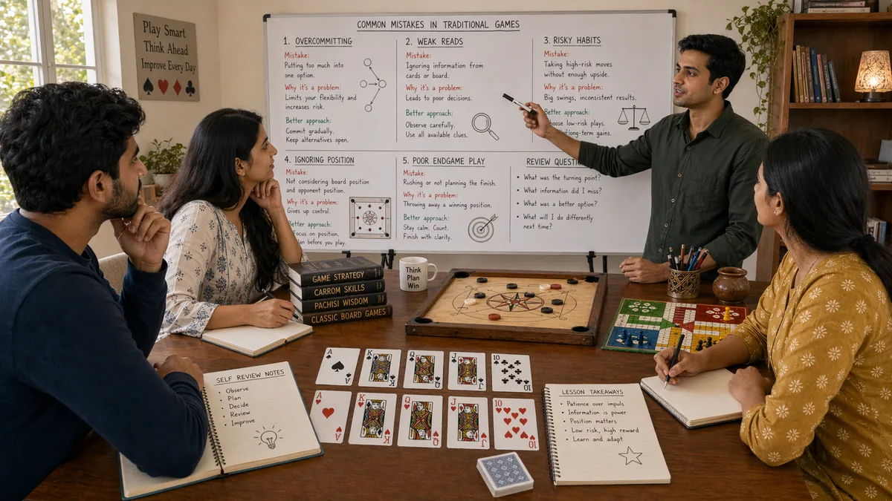

# Common Mistakes in Desi Game Strategy

## 🪶 Introduction

Every player makes mistakes, but understanding the most common ones helps you avoid them and recover faster when they do happen. In traditional South Asian games like Callbreak, Teen Patti, and Ludo, mistakes often come from predictable sources: emotional decisions, incomplete information usage, and poor long-term planning. This guide breaks down the most frequent errors so you can recognize them in your own play and fix them systematically.

Mistakes are not failures—they are information. Each one tells you something about your decision-making process and gives you a chance to improve. The best players in any desi game do not avoid all mistakes; they learn from them faster than their opponents and adjust their approach accordingly. Developing this learning habit is more valuable than trying to play perfectly from the start.

The patterns described here appear across skill levels. Even experienced players fall into these traps occasionally, especially when tired, distracted, or emotionally compromised. Recognizing the warning signs helps you catch yourself before the mistake becomes costly.

---

## 🖼️ Common Mistakes Overview

---

## 🎯 What Are Common Mistakes?

Common mistakes in desi game strategy are errors that occur frequently across many players, often because they feel natural in the moment but work against long-term success. These include betting with weak hands hoping to get lucky, ignoring opponent behavior patterns, overcommitting early in a session, and letting emotions drive decisions instead of logic. They tend to happen when players focus on immediate outcomes rather than the broader strategic picture.

Understanding why these mistakes happen is as important as knowing what they are. For example, calling a large bet with a mediocre hand feels attractive because you might hit the card you need. But the math rarely works out over time—you lose more than you win by calling with hands that have insufficient equity. Knowing the underlying reasoning helps you resist the impulse even when emotions are high.

Common mistakes also include strategic blunders like misreading board states, failing to plan beyond the current round, and not adjusting to opponent tendencies. These are more subtle than obvious betting errors but equally damaging to your overall win rate.

---

# 🧠 1. Chasing Results Instead of Making Good Decisions

A trap that affects players across all skill levels is evaluating decisions based on outcomes rather than the quality of the reasoning behind them. If you call with a drawing hand and hit your card, it feels like the right call—but it was only correct if the pot odds justified the risk. Calling with weak hands because you "got lucky" teaches you to make bad decisions.

Good decision-making means following the process, not chasing the result. If you evaluate a situation correctly and make the best available choice given the information you have, that is a good decision even if the outcome is unfavorable. Conversely, getting lucky with a reckless play is not a sign of skill—it is variance.

Keeping a decision journal can help you separate decisions from outcomes. Write down your reasoning before acting, then review later whether the reasoning was sound, regardless of what actually happened. This builds the habit of evaluating choices by process rather than by results.

---

# 🧠 2. Ignoring Opponent Patterns and Tendencies

Many players focus exclusively on their own hand and the visible board, paying little attention to how opponents are playing. This misses a major source of strategic advantage. In Callbreak, opponents who consistently fail to cover tricks reveal something about their hand strength. In Teen Patti, players who bet differently in particular positions show exploitable tendencies.

Paying attention does not mean over-adjusting. If an opponent raises pre-flop in a certain way, that might be a pattern or might be a one-time adjustment to the table dynamics. The key is to notice, catalog mentally, and verify through subsequent action. When a pattern holds, you can exploit it. When it does not, you adjust your expectations.

Common blind spots include failing to track who is playing conservatively, missing opportunities to isolate weak players, and not recognizing when opponents are adjusting to your style. The game is always a conversation, and ignoring what the other players are saying leaves you deaf to critical information.

---

# 🧠 3. Over-Betting and Under-Betting Relative to the Situation

Betting the wrong amount is a frequent source of lost value and unnecessary risk. Over-betting means risking more than the situation warrants, often when a player is tilted or overconfident after a win. Under-betting means failing to extract maximum value from strong hands or failing to bluff effectively with weak ones.

Proper bet sizing requires reading the situation holistically. In Teen Patti, the size of the pot, the texture of the board, and the tendency of your opponent all influence what size bet makes sense. A monster hand might deserve a large bet to build the pot, but if the board is coordinated and dangerous, a smaller bet might keep opponents in when a large bet would chase them out.

The goal of betting is not simply to win the pot—it is to make decisions that are profitable over time. Sometimes a small bet is correct. Sometimes folding is correct. Bet sizing internalizes this by forcing you to think about the expected value of each size choice.

---

# 🧠 4. Playing Too Many Hands or Games

In games that offer many opportunities to play, such as Teen Patti with rapid betting rounds, it is tempting to play every hand. This rarely works out well. Hands that are marginal before the flop or before seeing the full board become even more marginal after more information arrives. Playing too many hands dilutes your focus and increases the number of decisions where you are working with insufficient data.

Selective play means waiting for situations where you have an edge, whether from position, card strength, opponent reads, or board texture. Patience is a skill in its own right. Waiting for good spots requires discipline but pays off in better decision quality when you do play.

This does not mean never playing marginal hands—sometimes pot odds and implied odds make calling correct even with weaker holdings. But playing every hand out of restlessness or boredom is a clear mistake that erodes bankroll and attention.

---

# 🧠 5. Failing to Plan Beyond the Current Hand

Short-term thinking causes players to make decisions that feel good immediately but create problems later. In Callbreak, winning a trick by using your highest trump might let you claim victory in that hand but leave you unable to cover later tricks when you need to. In Ludo, sending one token home might seem like progress but expose others to capture.

Strategic planning means thinking about how current decisions interact with future possibilities. What will the board look like in two rounds? How will your chip stack compare to opponents? What options will you have if you take this action versus that one? Players who plan ahead keep more options open and avoid unnecessarily limiting themselves.

This planning does not need to be complex. Simple questions like "what happens if my opponent responds in the worst possible way" help you see whether your planned move creates unacceptable vulnerability. Avoiding those vulnerabilities is the essence of sound long-term planning.

---

# 🧠 6. Letting One Loss or Win Distort Future Decisions

After a significant win or loss, the emotional residue can distort future decisions for several hands or even longer. A big win might make you feel invincible and lead to oversized bets. A bad beat might make you play too conservatively or chase revenge by taking undue risks.

The antidote is maintaining perspective across sessions. A single hand, round, or session is not meaningful in isolation. Over hundreds of hands, your actual skill level emerges from the randomness. Treating results with appropriate detachment prevents emotional leakage from affecting decisions.

Practical steps include setting session bankrolls in advance, taking breaks after emotional events, and reviewing your play with the assumption that you will see similar situations many times. When you know you will face the same decision again, you focus more on the process and less on any single outcome.

---

# 🧠 7. Misreading Board Texture and Game State

The visible game state—cards on the board, tokens on the board, opponent stacks—provides critical information that many players underutilize. Misreading texture means either missing opportunities that are clearly present or seeing patterns that are not actually there.

In Teen Patti, a coordinated board with many possible straights or flushes changes how you evaluate hands dramatically. A pair might be strong on a dry board but weak on one with multiple drawing possibilities. In Ludo, the distribution of tokens across the board reveals safety and threat levels that should influence movement decisions.

Board reading improves with deliberate practice. After each hand, think about what the board told you and whether you used that information effectively. Building this habit creates a significant advantage because many opponents never develop the skill at all.

---

## ⚠️ Common Mistakes

- **Evaluating decisions by outcomes instead of process quality**: Getting lucky with a bad call feels rewarding but reinforces poor decision-making habits that lose money over time.

- **Paying no attention to opponent tendencies**: Missing information that opponents are broadcasting through their actions, leaving you unable to adjust your strategy exploitatively.

- **Betting without thinking about sizing rationale**: Choosing bet sizes arbitrarily or emotionally rather than based on pot odds, opponent tendencies, and hand strength.

- **Playing too many hands out of restlessness**: Calling or playing marginal hands just to be involved, which dilutes decision quality and burns bankroll.

- **Focusing only on the current hand**: Making moves that solve immediate problems but create larger issues in subsequent rounds.

- **Allowing emotional residue to affect future decisions**: Carrying the glow of a win or the sting of a loss into subsequent decisions, distorting judgment.

- **Misreading the board or game state**: Failing to see what the current situation actually tells you, either undervaluing real threats or seeing patterns that do not exist.

---

## 🧾 Summary

Avoiding common mistakes requires awareness, practice, and the discipline to review your play honestly. Focus first on the mistakes that cost you the most—often emotional decisions and failure to gather information. Build habits like decision journaling and regular review to catch patterns in your own errors. Over time, your mistake rate will drop and your recovery time when you do err will shorten. Strategic improvement is incremental, and each mistake avoided or learned from is progress toward better results.

---

## 🔥 SEO Keywords

common mistakes desi games
teen patti mistakes to avoid
callbreak strategy errors
ludo common mistakes
strategy mistakes South Asian games
gameplay errors traditional games

---

## Related Pages

- [Fundamentals](./fundamentals.md)
- [Decision Making](./decision-making.md)
- [Game Awareness](./game-awareness.md)

## External Reference

For a broader reference, see [related gameplay notes](https://market-lab-cmd.github.io/india-skill-gaming-hub/)