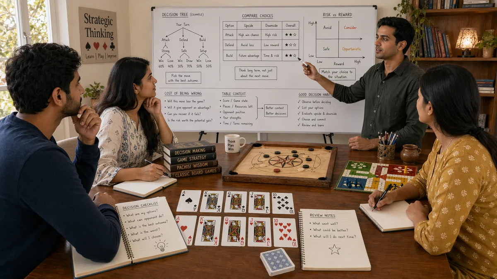

# Decision Making in Desi Game Strategy

## 🪶 Introduction

Decision making sits at the heart of every game in the South Asian tradition. Whether you are playing Callbreak, Teen Patti, or Ludo, each moment presents choices that accumulate into your final result. Understanding how to make better decisions—not just making more decisions—separates skilled players from casual ones. This guide focuses on the mental process of evaluating options, weighing probabilities, and committing to choices under uncertainty.

Good decision making is not about perfection. It is about having a reliable process that produces favorable results over time. You will still make wrong decisions sometimes; the goal is to make fewer of them and to learn faster from the ones you do make. This requires understanding not just what to decide but how to decide, which is the real skill underlying any specific game mechanic.

The principles here apply broadly, but each game has unique decision points and pressures. Callbreak requires quick judgments under time pressure. Teen Patti combines math with psychological reading. Ludo demands spatial planning alongside positional awareness. Recognizing these differences helps you adapt your decision-making framework to whatever game you are playing.

---

## 🖼️ Decision Making Overview

---

## 🎯 What Is Decision Making?

Decision making in game strategy is the process of evaluating available options, estimating likely outcomes, and selecting the action that best serves your strategic goals. It involves weighing factors like current hand strength, position, opponent tendencies, pot odds, and future possibilities. The goal is not to find a perfect move but to make a choice that has positive expected value given what you know.

Decisions in these games range from simple to complex. Folding a clearly weak hand in early position is straightforward. Deciding whether to call a large bet with a drawing hand in late position is complex and requires integrating multiple factors. Developing skill means handling both types well—the obvious decisions without arrogance and the difficult ones without paralysis.

Strong decision makers also know when to trust their instincts versus when to reason explicitly. Experience creates intuition that works in familiar situations. Analysis provides confidence in unfamiliar ones. The art is knowing which tool to reach for in each moment.

---

# 🧠 1. Identifying the Decision Point

Before making any choice, you need to clearly identify what decision you are actually facing. In practice, many players move automatically without realizing what they are deciding. In Teen Patti, a bet might prompt only the binary question of whether to call, when the real decision might be about how much to raise or whether to try a specific bluff. In Callbreak, playing a card might seem like a simple response when it actually involves choosing between multiple viable strategies.

Identifying the decision point means asking: what are my actual options here? What are the consequences of each? When do I need to decide? Often, the apparent decision is not the only one, and recognizing the full scope opens up better alternatives.

This step also involves recognizing decisions that do not belong to you. If an opponent is the one facing a choice, your job is to influence their decision through your actions, not to make their decision for them. Understanding who holds the decision helps you play your own hand correctly.

---

# 🧠 2. Gathering and Weighting Relevant Information

Once you know what decision you face, the next step is gathering the information that bears on it. This means everything you know about the current game state: your cards, the board, opponent actions, position, stack sizes, and any relevant history. The skill lies in weighting this information appropriately—not ignoring things that matter and not overweighting things that do not.

Not all information is equally valuable. Opponent betting patterns often matter more than card strength in games with incomplete information. Position matters more when you have less data about opponent holdings. Stack sizes affect whether certain plays are even available. Learning to weight factors correctly takes experience and honest self-review.

Information gathering also means knowing what you do not know. Acknowledging uncertainty is not weakness—it allows you to make decisions with appropriate caution. Treating partial information as complete leads to overconfidence and poor choices.

---

# 🧠 3. Calculating Expected Value for Key Options

Expected value (EV) is the core concept behind sound decision making. For any choice, you estimate the probability of each outcome, multiply by the value of that outcome, and sum to get the EV. The action with the highest positive EV is generally the right one, though risk tolerance and game-specific considerations can modify this.

In practice, you rarely calculate precise EVs. Instead, you develop an intuitive sense of which options are better and worse. In Teen Patti, calling a bet requires estimating how often your hand wins if you see all cards, then comparing that to the pot odds you are receiving. In Callbreak, playing a card requires estimating how likely it is to win the trick and what you give up by not playing something else.

EV thinking prevents common errors like chasing unlikely outcomes or folding to reasonable pressure. It grounds decisions in mathematics rather than emotion, which is especially valuable when the outcome is uncertain or when you are tempted by a high-risk option.

---

# 🧠 4. Considering Reverse Implied Odds and Future Play

Simple EV calculations ignore how current decisions affect future possibilities. Reverse implied odds refer to the money you might lose in future rounds if you make the current call and then hit a hand that is beaten by what opponent holds. This is a common blind spot in Teen Patti, where drawing hands can be costly even when the immediate pot odds look favorable.

In Callbreak, playing aggressively early might win the round but leave you unable to cover tricks later when the stakes are higher. In Ludo, advancing one token might seem good but expose others to capture, creating net negative expected value despite the immediate gain.

Future play considerations also include options you might lose if you commit now. If making a bet eliminates your ability to check later, that restricts your future choices. Good decision making weighs not just immediate EV but also how current choices open or close future strategic options.

---

# 🧠 5. Making the Decision and Committing

After analysis, you need to actually decide and act on it. Hesitation or second-guessing after commitment often leads to poorly executed plays. If you have done the work of evaluating the situation, trust your process and follow through. Changing your mind after putting chips in the pot or playing a card creates confusion for you and gives opponents information.

Commitment does not mean refusing to adjust if new information arrives. If an opponent suddenly acts in a way that changes your read of the situation, updating your plan is not waffling—it is responsive play. The key is distinguishing between new information that warrants adjustment and anxiety that does not.

Practicing commitment means playing your decisions with confidence even when the outcome is uncertain. Over time, this builds a reputation that makes your actions more credible and your play more effective.

---

# 🧠 6. Reviewing Decisions Separately from Outcomes

After the hand resolves, reviewing your decision is essential for improvement. The goal is to evaluate whether the choice was sound given what you knew at the time, not whether it happened to work out. A good decision that gets unlucky is still a good decision; a lucky decision that works is still a bad process.

Review involves asking: did I correctly identify the decision point? Did I gather and weight information appropriately? Did I calculate EV correctly? Did I consider future implications? The answers reveal what you got right and what needs adjustment.

Keeping a decision journal or discussing hands with other players accelerates this review process. External perspectives catch errors your own review misses. Over time, this habit builds pattern recognition and faster decision-making.

---

# 🧠 7. Managing Time Pressure and Acting Without Complete Information

Desi games often involve time pressure—whether the turn timer in online Callbreak or the natural pace of an in-person Ludo match. Decisions made under time pressure are frequently worse, which means developing skill at acting with incomplete information is crucial.

Managing time pressure starts with preparation. Knowing your general strategy for common situations means you spend less time deliberating when they arise. Practicing decision-making in low-pressure environments builds the mental patterns you will need when pressure is higher.

Acting without complete information means developing comfort with uncertainty. In Teen Patti, you never know what opponents hold. In Callbreak, you guess from betting patterns and play style. Building this tolerance prevents paralysis when information is scarce and lets you make timely decisions even when the picture is incomplete.

---

# 🧠 8. Adjusting Decisions Based on Opponent Types

Not all opponents require the same decisions. Against passive players who rarely bet or raise, different plays are optimal than against aggressive players who apply constant pressure. Adjusting to opponent types is a fundamental part of decision-making that many players neglect.

The key is observation and adaptation. If an opponent rarely bluffs, you can call more confidently with moderate hands. If an opponent over-bluffs, you can fold more often and exploit their frequency. Against unknown opponents, default to sound general strategy; as you gather information, adjust accordingly.

Adjustment also works in reverse—if opponents are adjusting to you, you need to recognize that and respond. A table that has learned you only bet with strong hands will fold more often, making your bluffs less effective. Mixing your play keeps opponents uncertain and maintains your strategic flexibility.

---

## ⚠️ Common Mistakes

- **Failing to identify the real decision**: Acting on the surface question rather than recognizing the broader strategic choice, which leads to suboptimal outcomes.

- **Overweighting recent results**: Letting a few hands influence decisions in ways that do not reflect actual probabilities or opponent tendencies.

- **Ignoring reverse implied odds**: Calling bets based on immediate pot odds without considering future rounds and likely losses when drawing hands complete.

- **Paralyzing under uncertainty**: Waiting for more information that will not arrive or cannot be obtained, leading to time pressure mistakes.

- **Committing without a decision process**: Acting based on feeling rather than analysis, which makes learning from results impossible and improvement unlikely.

- **Not reviewing decisions after the fact**: Missing the feedback loop that separates good from great players, repeating mistakes without recognizing them.

---

## 🧾 Summary

Decision-making skill develops through conscious practice and honest review. Focus on identifying the true decision point, gathering information systematically, calculating expected value, considering future implications, committing confidently, and reviewing rigorously. Managing time pressure and adjusting to opponent types completes the framework. These steps might feel slow initially, but with practice they become automatic, making your decisions faster and more accurate. The goal is a reliable process that generates positive results over hundreds of hands and sessions.

---

## 🔥 SEO Keywords

decision making strategy desi games
teen patti decision making
callbreak strategic decisions
game decisions South Asian games
expected value calculation games
strategic choice traditional games

---

## Related Pages

- [Fundamentals](./fundamentals.md)
- [Game Awareness](./game-awareness.md)
- [Strategic Thinking](./strategic-thinking.md)

## External Reference

For a broader reference, see [related gameplay notes](https://market-lab-cmd.github.io/india-skill-gaming-hub/)