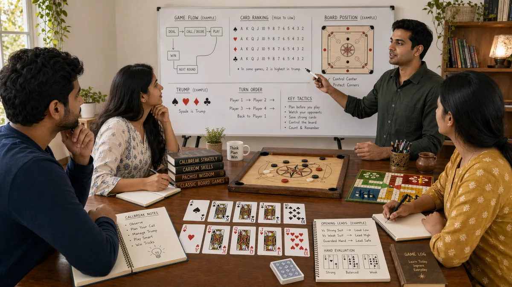

# Fundamentals of Desi Game Strategy

## 🪶 Introduction

Understanding the fundamentals of traditional South Asian games is essential for anyone looking to improve their strategic play. These games—including Callbreak, Teen Patti, and Ludo—have been passed down through generations, each carrying cultural significance alongside their strategic depth. Learning the foundational principles gives you a structured way to think about decisions, anticipate opponents, and make better choices under pressure.

The core ideas covered here apply across different games, so even if you switch between variations or try new games within the South Asian gaming tradition, these fundamentals will serve as a reliable base. Rather than memorizing tricks, you are building a mindset that adapts to different situations. This approach takes longer than quick tips but creates lasting improvement.

Strategic fundamentals are especially important in games where you play multiple rounds against the same opponents, as happens in Callbreak tournaments or informal Teen Patti sessions with friends. In these contexts, how you think about the game matters more than any single move. The goal here is to give you that thinking framework.

---

## 🖼️ Fundamentals Overview

---

## 🎯 What Is Fundamentals?

Fundamentals in desi game strategy refer to the core principles and habits that underlie good decision-making. These are not specific techniques for a particular game but rather universal habits of thought—like knowing how to evaluate a situation before acting, understanding risk versus reward, and recognizing patterns that repeat across games. A player with strong fundamentals can sit down at any traditional game and reason their way to better decisions, even if they have never played that exact version before.

Strong fundamentals also include emotional discipline. Games with incomplete information—like Teen Patti or Callbreak—create frustration and temptation. Fundamental mastery means you stick to your reasoning process even when the outcome feels uncertain. This emotional steadiness is what separates consistent players from those who win sometimes but lose more than they should.

Finally, fundamentals include the habit of review. After each session, good players think about what went right, what went wrong, and why. This reflective practice builds intuition over time and prevents the same mistakes from repeating endlessly.

---

# 🧠 1. Evaluating Position Before Acting

Before making any move, you should understand where you stand in the game. This sounds simple, but many players rush to act without first assessing the full situation. In Callbreak, for example, this means counting your high cards, estimating how many tricks you can realistically win, and considering what your opponents likely hold based on their previous plays.

Taking five to ten seconds to evaluate position gives you enormous advantage over players who react impulsively. This pause is not hesitation—it is strategic preparation. You are gathering information and forming a plan before committing to a line of play.

Position evaluation also means understanding what is at stake in the current round. In games with betting, like Teen Patti, the size of the pot changes how much you should value certain decisions. A small pot might not justify aggressive bluffs, while a large one changes the math entirely.

---

# 🧠 2. Understanding Risk and Reward

Every decision in a strategic game carries some combination of risk and reward. The key is to evaluate whether the potential gain justifies the possible loss, not just in the current round but across the broader game. In Ludo, rushing a token onto the board might give you an immediate advantage but leave you exposed later. In Callbreak, going all-in on a high bet might win the round but leave you unable to cover the required tricks later.

Skilled players think in expected value terms—not whether a move will definitely work, but whether it works often enough to be profitable over time. A risky move with high reward might be worth taking if the odds are favorable. A low-risk move with modest rewards might be better when the situation is uncertain.

The trick is avoiding two extremes: playing too conservatively and missing opportunities, or playing too aggressively and losing more than you can afford. Balance comes from reading the game state and adjusting your tolerance for risk accordingly.

---

# 🧠 3. Information Gathering and Usage

Strategic games are fundamentally information games. You never have complete information, but you constantly receive new data—through opponent behavior, card distribution, board state, and betting patterns. Strong fundamentals mean you actively look for this information and update your thinking as the game progresses.

In Teen Patti, opponents who suddenly increase their bets are signaling something, though you need to distinguish between genuine strength and a bluff. In Callbreak, watching which suits opponents play tells you about their remaining holdings. In Ludo, seeing where tokens sit reveals vulnerability and opportunity.

Gathering information is not passive. You make small bets or plays specifically to test opponent reactions. A strategic raise in Teen Patti might be designed to learn whether an opponent has strong cards, not necessarily to win the pot immediately. This testing mindset turns every round into a data collection opportunity.

---

# 🧠 4. Habitual Pattern Recognition

Patterns appear repeatedly in traditional games, and recognizing them helps you react faster and more accurately. Experienced players do not consciously catalog every pattern—they develop intuition through repeated play. However, you can accelerate this process by deliberately paying attention to recurring situations.

Common patterns include opponent tendencies, betting rhythms, and board configurations. If you notice a player always raises with strong hands, you can adjust by folding more often against them or by trapping with a strong hand. If the board keeps producing certain outcomes, you can anticipate similar results next time.

Pattern recognition works best when combined with healthy skepticism. Not every pattern is meaningful—sometimes things happen randomly. The key is to notice patterns, test them mentally, and update your expectations only when the evidence is strong enough. This prevents both overreaction and underreaction to opponent behavior.

---

# 🧠 5. Managing Resources Across Rounds

Desi games typically involve multiple rounds or hands, which means you are not playing for a single victory but for cumulative performance. Managing your resources—chips, card strength, positional advantage—across rounds is a fundamental skill that separates good from great players.

In Callbreak, if you overspend your high cards early trying to win every trick, you may run dry when the final rounds come. In Teen Patti, betting too aggressively in early hands can leave you short-stacked when premium cards finally arrive. In Ludo, sending all tokens home early might seem good but leaves you with no backup if your opponent captures your pieces.

Resource management also means knowing when to be patient and when to push. Sometimes the smart play is to do little or nothing, preserving resources for a better moment. Other times you need to act decisively because the opportunity will not return. Reading the flow of the game tells you which approach is appropriate.

---

# 🧠 6. Controlling Emotional Reactions

Emotional control is a fundamental that most players underestimate. Frustration after a bad beat, excitement after a big win, or anxiety about falling behind—all of these emotions push you toward decisions you would not make calmly. Managing them is a skill, not a trait, which means it can be developed with practice.

The first step is recognizing when emotion is influencing your decisions. If you find yourself wanting to "just win this hand" rather than making a reasoned choice, you are likely acting emotionally. Pausing and asking why you want to make a particular move helps separate emotion from analysis.

Practical techniques include taking breaks after losing hands, setting loss limits before playing, and focusing on decisions rather than outcomes. Over a single hand or round, luck dominates. Over many rounds, skill dominates. Keeping your attention on the process rather than immediate results prevents emotional spiraling and keeps your decision-making sharp.

---

# 🧠 7. Positional Awareness in Multi-Player Games

Where you sit relative to other players matters in games like Callbreak and Teen Patti. Being in late position gives you more information before you act—you see what others do before you need to decide. Being in early position means you act with less information, which generally makes decisions harder.

Positional awareness extends beyond seat position. In Teen Patti, the player who acts first after the flop sees the community cards before most others, which changes how they evaluate their hand. In Callbreak, the order of play in each trick affects which cards you should lead with and which you should hold back.

Using position well means being more aggressive when you have information advantage and more cautious when you lack it. In late position, you can sometimes play weaker hands profitably because you know more about opponent intentions. In early position, you need stronger holdings to take the same actions.

---

# 🧠 8. Planning Multiple Steps Ahead

Strong strategic players think several moves ahead, even in games with incomplete information. This does not mean predicting exact outcomes but rather considering how the current decision affects future options. In Callbreak, winning a trick but losing your ability to handle futuretrump situations might be a net negative. In Ludo, sending one token home might set up a sequence that wins the game several moves later.

Multi-step planning requires visualizing possible future states. Ask yourself what happens if you make this move and your opponent responds in different ways. Which outcomes keep you in good position? Which create problems? Planning broadly gives you flexibility because you are not locked into a single expected path.

This skill improves with practice. After each game, review not just what happened but what you anticipated would happen. Over time, your ability to see further ahead will improve, and you will make decisions that keep multiple options open rather than painting yourself into corners.

---

## ⚠️ Common Mistakes

- **Playing reactively instead of proactively**: Waiting for opponents to act and then responding, rather than shaping the game yourself. This leaves you always one step behind and makes it harder to anticipate opponent moves.

- **Ignoring bankroll and resource management**: Betting too much in early rounds, leaving yourself short-stacked when critical moments arrive. Sustainable play means planning across the entire session, not just the current hand.

- **Failing to gather and use information**: Playing your own hand without considering what opponents' actions tell you. Every bet, call, and fold is data that informs your decisions.

- **Letting emotions drive decisions**: Chasing losses, playing too aggressively after wins, or making snap decisions when frustrated. Emotional play almost always costs more than it gains.

- **Overestimating pattern significance**: Seeing a few hands where an opponent raised aggressively and assuming they always do so, leading to incorrect adjustments. Patterns need confirmation before you act on them.

- **Neglecting position in decision-making**: Acting the same way regardless of where you sit relative to opponents. Position is information, and using it properly is a fundamental skill.

---

## 🧾 Summary

Fundamentals form the foundation of strong strategic play in desi games. By focusing on position evaluation, risk-reward analysis, information gathering, pattern recognition, resource management, emotional control, positional awareness, and multi-step planning, you build a skill set that transfers across games and variations. These are not quick tricks but durable habits that improve your play over time. Start by focusing on one or two areas—emotional control and position awareness are often the highest-impact starting points—and expand from there as they become automatic.

---

## 🔥 SEO Keywords

desi game strategy fundamentals
traditional South Asian games strategy
Callbreak strategy basics
Teen Patti strategic fundamentals
Ludo game fundamentals
beginner strategy guide South Asian games
strategic thinking traditional games

---

## Related Pages

- [Strategic Thinking](./strategic-thinking.md)
- [Decision Making](./decision-making.md)
- [Game Awareness](./game-awareness.md)

## External Reference

For a broader reference, see [related gameplay notes](https://market-lab-cmd.github.io/india-skill-gaming-hub/)