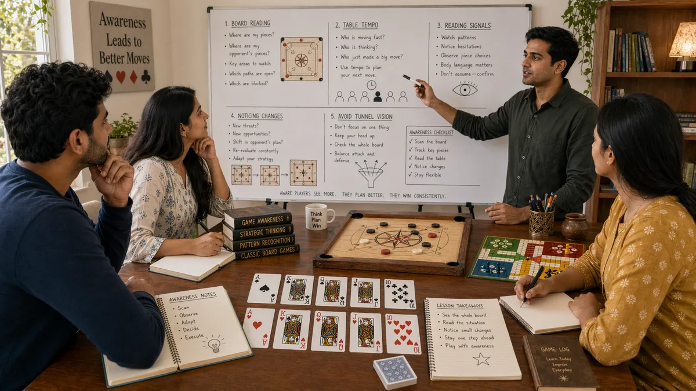

# Game Awareness in Desi Game Strategy

## 🪶 Introduction

Game awareness is the ability to read the complete state of a game at any moment—not just your own cards or pieces, but the entire situation including opponent positions, stack sizes, remaining opportunities, and likely trajectories. This comprehensive awareness forms the backdrop against which all strategic decisions are made. Without it, even technically correct decisions can be wrong because they do not fit the actual game context.

Developing game awareness means seeing the game as a whole rather than focusing narrowly on one aspect. In Callbreak, it means knowing how many tricks each player has taken and what distribution of suits remains. In Teen Patti, it means tracking the betting history to estimate opponent ranges. In Ludo, it means understanding the board state across all quadrants, not just your own tokens.

This awareness is not a single skill but a cluster of related abilities: observation, memory, pattern recognition, and contextual reasoning. Each can be developed separately but they work together to give you a complete picture of the game. Players who cultivate these abilities see more opportunities and avoid more traps than those who play reactively.

---

## 🖼️ Game Awareness Overview

---

## 🎯 What Is Game Awareness?

Game awareness is the comprehensive understanding of all elements relevant to making strategic decisions in a game. It includes knowing your own position and resources, understanding opponent tendencies and current states, tracking what has happened in the past, and anticipating how the game might unfold. This awareness is the foundation that informs decision-making, pattern recognition, and strategic planning.

Game awareness differs from simple observation. Observation is noticing what is happening; awareness is understanding what it means in the larger context. When you see an opponent bet in Teen Patti, observation tells you they bet. Awareness tells you what that bet likely indicates about their hand, how it fits their pattern, and how you should respond.

Strong game awareness also means knowing what you do not know. The game state might not reveal everything, and awareness includes recognizing the boundaries of your knowledge and adjusting confidence accordingly.

---

# 🧠 1. Tracking the Full Game State

The foundation of game awareness is knowing what the game actually looks like at any moment. In Callbreak, this means counting tricks won by each player, tracking high cards played, and estimating what suits are likely exhausted. In Teen Patti, it means remembering every bet, raise, and fold across the hand. In Ludo, it means knowing where every token on the board sits.

This tracking requires active mental effort, especially as the game progresses and information accumulates. Developing efficient methods—like categorizing information visually or using short mental summaries—helps you maintain awareness without cognitive overload. Some players use notation systems or physical tracking where allowed by the game format.

The full game state also includes non-obvious elements: the order of play, which positions have acted, how the betting has progressed, and what options remain open to each player. These details matter for reading opponents and planning ahead.

---

# 🧠 2. Reading Opponent States and Intentions

Beyond the visible game state, awareness includes estimating opponent conditions and likely intentions. In Teen Patti, this means inferring hand strength from betting behavior. In Callbreak, it means guessing what cards opponents hold based on what they have played and how they have bet. In Ludo, it means anticipating which tokens opponents will try to capture or advance.

Reading opponents is not mind-reading—it is probability estimation based on observable behavior and game theory. You estimate what range of hands or strategies an opponent likely has, then make decisions that perform well against that range. As more information arrives, you update these estimates.

Accurate reading requires distinguishing between signal and noise in opponent behavior. Some actions clearly indicate strength or weakness; others are ambiguous or designed to mislead. Developing judgment about which is which comes from experience and review.

---

# 🧠 3. Understanding Tournament or Session Context

Individual hands exist within a larger context—a tournament structure, a cash game session, or a casual match with friends. This context affects optimal strategy significantly. In a tournament with increasing blinds, stack preservation becomes critical. In a cash game where you can reload, individual hand risk tolerance might be higher.

Game awareness includes knowing where you stand relative to other players in the session. Are you a short stack needing to take action, or a big stack who can apply pressure? Are other players playing for first place or just trying to finish in the money? Answers to these questions change which decisions are correct.

Session context also includes knowing the pace and dynamics of the current game. Is the table tight and cautious, or loose and active? Are players tilted or focused? Adjusting your play to fit the current context is part of full awareness.

---

# 🧠 4. Anticipating Game Trajectory and End States

Strong game awareness includes understanding how the current situation will likely evolve. In Callbreak, if you know certain players struggle to cover required tricks, you can plan to apply pressure in specific rounds. In Ludo, if you can see a path to controlling the home stretch, you make moves that set up that outcome.

Anticipating trajectory means thinking about what the board looks like in two or three rounds, not just what is happening now. This requires understanding typical game flows and how current decisions affect future possibilities. Players with strong anticipatory awareness avoid decisions that seem good now but create problems later.

End state awareness is particularly valuable. Knowing roughly what the game looks like when it ends—whether in points, chips, or tokens—helps you evaluate whether your current trajectory is favorable and what adjustments might be needed.

---

# 🧠 5. Maintaining Awareness Under Pressure

Games with time limits or high stakes create pressure that degrades awareness. Under pressure, players focus narrowly on immediate problems and lose sight of the broader game state. Developing the ability to maintain awareness when stakes are high is a crucial skill.

Pressure management starts with preparation. If you have pre-planned responses to common high-pressure situations, you spend less cognitive effort reacting and more maintaining overall awareness. Practice in lower-stakes situations builds the habits that transfer to high-pressure moments.

Breathing and mental reset techniques help when awareness starts to narrow. Taking a fraction of a second to breathe and refocus can restore the big-picture perspective. Even in games with rapid decision cycles, small pauses prevent the tunnel vision that leads to costly errors.

---

# 🧠 6. Updating Awareness with New Information

Game state changes constantly, and awareness must update accordingly. After each action—an opponent's bet, a card revealed, a token moved—you should incorporate that new information into your understanding of the current situation. Players who do not update miss changes that affect their decisions.

Updating awareness is not just noticing what changed but revising your estimates and plans accordingly. If an opponent who was playing conservatively suddenly becomes aggressive, that change might indicate a shift in their hand, their stack, or their strategy. Incorporating this update changes what the correct response is.

Efficient updating means building trigger conditions—when certain things happen, you automatically check certain conclusions rather than waiting to consciously reconsider. This automaticity keeps awareness current without constant deliberate effort.

---

# 🧠 7. Using Board Texture and Game Flow Information

Board texture refers to what the overall game state looks like—the cards on the table, the distribution of tokens, the remaining opportunities. In Teen Patti, a coordinated board with flush and straight possibilities is "wet" while one with disconnected ranks is "dry." In Ludo, a board where opponents control key squares is threatening while open paths are favorable.

Game flow describes how the session is developing—whether action is increasing, whether players are playing tighter, whether momentum is shifting. Reading flow helps you anticipate when to press advantages and when to consolidate.

Texture and flow are not separate from other awareness elements—they integrate with them. A wet board in Teen Patti changes how you read opponent hands and adjust your own strategy. A board where you control the center in Ludo changes how aggressive you can be in advancing tokens.

---

# 🧠 8. Balancing Depth and Breadth of Awareness

There is a tension in game awareness between looking broadly at everything and looking deeply at specifics. Too broad and you miss crucial details. Too deep and you lose sight of the overall picture. Finding the right balance is a skill developed through experience.

Different game situations call for different balances. When a critical decision is imminent, deeper focus on relevant details is appropriate. When the game is in a stable phase, broader awareness helps you plan and anticipate. Good players shift this balance fluidly based on what the moment requires.

Cognitive limits exist for everyone. Awareness management means directing attention to where it matters most given the current game state. In Callbreak, this might mean focusing more on opponents who are close to covering their required tricks. In Teen Patti, it might mean focusing more on players who have shown strong hands recently.

---

## ⚠️ Common Mistakes

- **Focusing only on own hand or position**: Ignoring opponent states, board texture, and session context, which leads to decisions that do not fit the actual game situation.

- **Failing to update awareness as game progresses**: Treating information from earlier in the game as static rather than continuously revising based on new observations.

- **Missing subtle but critical signals**: Overlooking small details in betting patterns, body language, or board state that reveal important information.

- **Losing awareness under time pressure**: Narrowing focus when stakes are high, which causes important context to be forgotten during critical decisions.

- **Not tracking non-obvious game elements**: Forgetting betting history, trick counts, or position order, which limits ability to read opponents accurately.

- **Over-analyzing causing awareness paralysis**: Trying to track everything perfectly, which creates cognitive overload and worse decisions than imperfect but functional awareness.

---

## 🧾 Summary

Game awareness is a developable skill that improves strategic decision-making across all desi games. Build your awareness by tracking the full game state actively, reading opponent states and intentions, understanding session context, anticipating trajectories, maintaining awareness under pressure, updating continuously with new information, using board texture and flow, and balancing depth and breadth appropriately. These abilities work together and reinforce each other. Start by focusing on tracking and updating in games where you have time to think, then practice applying awareness in faster-paced situations.

---

## 🔥 SEO Keywords

game awareness strategy desi games
teen patti board awareness
callbreak game state reading
ludo board awareness
strategic awareness traditional games
comprehensive game reading skills

---

## Related Pages

- [Fundamentals](./fundamentals.md)
- [Pattern Recognition](./pattern-recognition.md)
- [Strategic Thinking](./strategic-thinking.md)

## External Reference

For a broader reference, see [related gameplay notes](https://market-lab-cmd.github.io/india-skill-gaming-hub/)