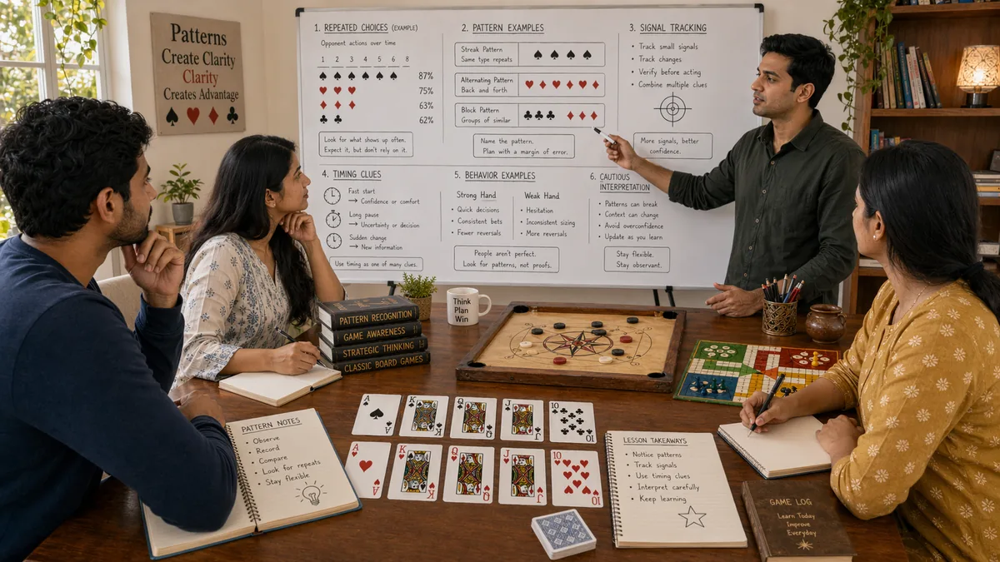

# Pattern Recognition in Desi Game Strategy

## 🪶 Introduction

Pattern recognition is one of the most valuable skills in any strategic game. Your brain is wired to find patterns, and with deliberate practice, you can turn this natural ability into a reliable strategic advantage. In traditional South Asian games, patterns appear in opponent behavior, betting rhythms, board configurations, and game flow. Recognizing them quickly and accurately lets you make better decisions with less conscious effort.

Pattern recognition is not about predicting exact outcomes. It is about recognizing tendencies and probabilities that give you an edge. When you notice that a Callbreak opponent consistently over-bets when they are short on tricks, you can adjust by folding more often against them. When you see that a Teen Patti table is playing very tight, you know that raises represent genuine strength more often than they would in a loose game.

The goal is building intuition that works automatically in familiar situations while still allowing deliberate analysis when patterns are unclear or unfamiliar. This combination of intuitive and analytical thinking is the mark of a skilled player.

---

## 🖼️ Pattern Recognition Overview

---

## 🎯 What Is Pattern Recognition?

Pattern recognition is the skill of identifying recurring elements or tendencies in game situations and using them to inform decisions. Patterns can be behavioral—like how a specific opponent plays after losing a big hand. They can be structural—like how certain board textures tend to produce certain outcomes. They can be temporal—like how betting节奏 changes as sessions progress.

Pattern recognition works because games, despite their complexity, have regularities. Opponents have tendencies that persist across hands. Board configurations create similar strategic situations. Session dynamics follow predictable arcs. Recognizing these regularities lets you transfer knowledge from past situations to current ones, which is faster and more accurate than analyzing each situation from scratch.

The skill involves both seeing patterns and correctly interpreting what they mean. A pattern might exist but not be useful for decisions. Or it might be real but short-lived because opponents adjust or game conditions change. Effective pattern recognition requires judgment about what to act on and what to ignore.

---

# 🧠 1. Betting Patterns and Rhythm Recognition

In games with betting, the size, timing, and frequency of bets create recognizable patterns. In Teen Patti, players who bet proportionally to their hand strength develop predictable sizing rhythms. In Callbreak, players who bet aggressively when they have won many tricks telegraph their confidence through betting patterns.

Recognizing betting patterns requires tracking information across multiple hands. Note who bets, how much, in what position, and how that relates to their holdings. Over time, you build a mental profile of each opponent's betting tendencies. This profile informs every subsequent hand against them.

Rhythm recognition also includes detecting when betting patterns change. A player who normally plays conservatively but suddenly bets large is signaling something important. A table that was loose and active but suddenly became tight is sending a message about how to adjust your strategy.

---

# 🧠 2. Board Configuration Patterns

Certain board or game states produce similar strategic situations repeatedly. In Teen Patti, paired boards are structurally different from coordinated boards and require different hand evaluations. In Ludo, boards where opponents cluster in certain zones create specific risks and opportunities that differ from spread-out configurations.

Learning to recognize board patterns helps you access relevant strategic knowledge quickly. When you see a coordinated board in Teen Patti, you immediately know that flush draws and straight draws are more relevant than you might have thought, and that middle pairs are more vulnerable. When you see a Ludo board with your tokens clustered safely at home, you know you can play more aggressively with remaining pieces.

Board patterns also interact with opponent tendencies. A coordinated board against tight opponents means different things than the same board against loose opponents who might be on draws. Pattern recognition includes understanding these interactions.

---

# 🧠 3. Opponent Behavioral Tendencies

Every player has habits and tendencies that persist across situations. Some players always raise with strong hands; others bluff frequently in certain positions. Some Callbreak players play high cards early to build momentum; others save them for crucial rounds. These tendencies are patterns you can recognize and exploit.

Building opponent profiles takes observation over multiple hands. Note how each player acts in different situations, especially when under pressure or facing difficult decisions. These moments reveal stable tendencies that betting cannot fully disguise.

Behavioral patterns also include things outside the game itself—body language, verbal cues, emotional reactions. While these can be misleading and should not be overweighted, genuine patterns here add information to your reads. The key is building confidence in patterns only after they appear consistently, not after one or two observations.

---

# 🧠 4. Session Flow and Dynamic Patterns

Games change over time as players adjust, stacks shift, and the tournament or session structure creates new pressures. Recognizing these flow patterns helps you anticipate transitions and adjust your strategy proactively.

Common session patterns include the "tighten up" phase after someone wins a big pot, the "loosen up" phase when blinds increase and players become more willing to take risks, and the "bubble" phase where players near the money become particularly conservative. Each of these affects optimal strategy.

Flow patterns also include your own dynamics—how your play changes as you get tired, how decisions differ when you are winning versus losing. Self-awareness about your own patterns helps you avoid the mistakes they create and exploit similar patterns in opponents.

---

# 🧠 5. Hand Strength Distribution Patterns

In games with incomplete information, understanding the likely distribution of hand strengths helps you evaluate your own position. In Teen Patti, if most players are folding early, the remaining opponents probably have stronger-than-average hands. In Callbreak, if most tricks have been won, remaining hands are probably weaker on average.

Hand strength distribution patterns affect both defense and offense. Against a range of likely strong hands, you need stronger holdings to continue. When you have a strong hand and opponents likely have weak ones, you can extract more value. Reading these distributions correctly is a core pattern recognition skill.

Distribution reading is especially important when making bluffs. If the board suggests opponents likely have weak hands, bluffs succeed more often. If opponents likely have strong hands, bluffs fail more often. Pattern recognition in this area directly affects your profitability.

---

# 🧠 6. Positional Pattern Recognition

Position creates systematic patterns in how information arrives and how decisions should be made. Late position players have more information than early position players, which changes optimal strategy in predictable ways. Recognizing positional patterns helps you exploit position advantages and compensate for position disadvantages.

In practice, positional patterns include how often players from different positions bet, raise, or fold. Some players defend early position more conservatively; others attack from late position more often. Building a map of these tendencies improves your ability to predict opponent actions and plan accordingly.

Positional patterns also affect how you should approach your own decisions. In early position, you need stronger hands to act aggressively because you lack information. In late position, you can play more hands because you have seen what others do first. Adjusting to these patterns systematically is a major source of edge.

---

# 🧠 7. Learning from Pattern Deviations

While patterns are useful, deviations from patterns are often even more informative. When an opponent who never bluffs suddenly bets large, that deviation tells you something significant. When a board texture that usually produces tight play instead sees loose action, something has changed.

Deviation recognition requires knowing what the normal pattern is before you can identify the deviation. This means building solid baseline expectations through observation. Only after you know what typical behavior looks like can you reliably detect when something unusual is happening.

Deviations require updated interpretation. A normally tight player who plays a hand aggressively probably has a genuinely strong hand. A normally loose player who suddenly plays tight might be trapping with a premium holding. Reading deviations correctly multiplies their informational value.

---

# 🧠 8. Developing Pattern Recognition Speed and Accuracy

Pattern recognition improves with practice, but the practice needs to be deliberate to develop speed and accuracy. Simply playing many hands creates some improvement, but focused attention on specific pattern types accelerates development.

Speed development involves practicing recognition in lower-stakes situations where errors cost less. Online games with quick hands let you see many patterns rapidly. Reviewing past hands also builds recognition by letting you see patterns in hindsight that you missed in real time.

Accuracy development involves testing your pattern reads against outcomes. If you think a pattern exists, track whether it actually predicts what you expect. Patterns that predict reliably are worth acting on; those that do not should be discarded or revised. This feedback loop builds strong pattern recognition over time.

---

## ⚠️ Common Mistakes

- **Seeing patterns that do not exist**: Random sequences can look like patterns, especially when you want them to. Confirm patterns with multiple observations before acting on them.

- **Overweighting recent patterns**: Recency bias makes recent observations seem more significant than they are. Weight patterns proportionally to sample size.

- **Failing to update patterns as opponents adjust**: Patterns that worked initially might stop working if opponents notice and adjust. Watch for signs of adaptation.

- **Ignoring base rates**: A player might seem to have a pattern, but if their baseline behavior is similar, the "pattern" might be noise.

- **Using patterns without verification**: Acting on a pattern after one observation leads to exploitation of fake patterns and poor decisions.

- **Neglecting your own patterns**: You also have patterns that opponents might recognize. Self-awareness helps you avoid becoming predictable.

---

## 🧾 Summary

Pattern recognition is a trainable skill that provides significant strategic advantage in desi games. Develop it by actively tracking betting rhythms, board textures, opponent tendencies, session dynamics, hand distributions, and positional patterns. Learn to recognize deviations from patterns as potentially valuable signals. Build both speed through practice and accuracy through verification against outcomes. The goal is a quick, reliable sense of what is happening in each game that complements deliberate analysis. Over time, pattern recognition becomes automatic and lets you focus on higher-level strategy.

---

## 🔥 SEO Keywords

pattern recognition desi game strategy
teen patti pattern recognition
callbreak betting patterns
ludo board patterns
strategic pattern identification
behavioral patterns South Asian games

---

## Related Pages

- [Game Awareness](./game-awareness.md)
- [Decision Making](./decision-making.md)
- [Advanced Concepts](./advanced-concepts.md)

## External Reference

For a broader reference, see [related gameplay notes](https://market-lab-cmd.github.io/india-skill-gaming-hub/)