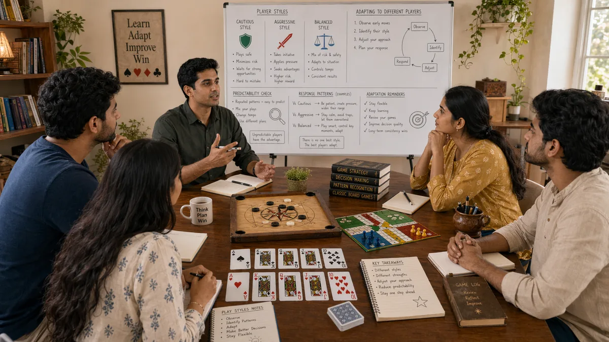

# Play Styles in Desi Game Strategy

## 🪶 Introduction

Players in traditional South Asian games do not all approach the game the same way. Some are aggressive, pressing advantages and taking risks. Others are conservative, preferring to preserve resources and avoid confrontation. Understanding these different play styles—both in yourself and in your opponents—helps you adjust your strategy to be more effective against each type. This adjustment is a major source of strategic edge.

Identifying play styles is not about labeling opponents as "good" or "bad." Tight players can win by waiting for strong hands. Loose players can win by applying pressure and forcing folds. The value of style recognition is knowing how to exploit each approach and how to avoid being exploited yourself.

Developing flexibility in your own play style also makes you harder to read. If you always play the same way, opponents can adjust and exploit you. If you mix approaches based on situation, you stay ahead of opponent adaptations. This strategic flexibility is a mark of advanced play.

---

## 🖼️ Play Styles Overview

---

## 🎯 What Are Play Styles?

Play styles are recurring patterns in how a player approaches decisions, bets, and overall game strategy. The main dimensions include tightness versus looseness (how many hands or actions you play) and aggressiveness versus passiveness (how willing you are to bet, raise, and pressure). Combining these dimensions creates recognizable player types: tight-aggressive, loose-passive, tight-passive, loose-aggressive.

Each style has strengths and weaknesses. Tight-aggressive players make few but strong decisions. Loose-passive players see many hands but rarely pressure opponents. Tight-passive players wait for premium opportunities but might miss value. Loose-aggressive players apply constant pressure but can be overextended. Understanding these profiles helps you predict behavior and respond effectively.

Play styles also include sub-dimensions like risk tolerance, bluffing frequency, position usage, and emotional control. These additional layers make each player unique even if they share a primary style label. Good reads incorporate all relevant dimensions.

---

# 🧠 1. Tight-Aggressive Style Characteristics

Tight-aggressive (TAG) players play few hands but play them strongly. They enter pots with quality holdings, bet and raise rather than check and call, and apply pressure when they have equity. Against these players, you face a narrow range that usually contains genuine strength.

The strength of TAG players is that they rarely make失控 decisions and extract value from strong hands efficiently. Their weakness is that they give up too easily when facing sustained resistance, and they can be forced out of pots with well-timed aggression. When a TAG player folds to a re-raise, they are usually accurately reading their position.

Exploiting TAG players involves either trapping them with strong hands (let them bet into you then raise) or making well-timed bluffs when they show weakness. Folding too much against their bets is a leak because they often have legitimate strength.

---

# 🧠 2. Loose-Passive Style Characteristics

Loose-passive (LP) players see many hands and rarely apply pressure. They call more than they bet or raise, often staying in hands longer than they should. Their passive nature means they rarely force opponents to make difficult decisions.

LP players are profitable to play against because they give up too easily when facing real pressure, yet they also call enough that you can extract value from strong hands. The risk is that they might hit unexpected cards that beat you, so you should size bets to account for these implied odds.

The challenge with LP players is that their passive nature sometimes traps aggressive players into over-playing against them. Being too aggressive against LP players can backfire when they call with anything and get lucky. The correct adjustment is to value-bet more and bluff less against these opponents.

---

# 🧠 3. Tight-Passive Style Characteristics

Tight-passive (TP) players wait for premium hands and play them cautiously. They rarely initiate action, preferring to see what others do before committing. When they do play, they usually have a genuine strong hand, but their overall approach limits how much they win from it.

TP players are often called "rocks" because their play is predictable and stable. Exploiting them requires patience—you know their range is narrow, so you can play more hands yourself and apply pressure when they show weakness. They rarely bluff, so folding to their bets is often correct.

The challenge with TP players is that they do not give up easily when they have real strength, so you should be cautious about bluffing them. When you have a genuine premium hand against a TP player, you can extract value by betting, but do not expect them to make crying calls with weak holdings.

---

# 🧠 4. Loose-Aggressive Style Characteristics

Loose-aggressive (LAG) players play many hands and apply pressure frequently. They bet, raise, and re-raise often, using aggression to take pots even with moderate holdings. Their style is high-variance but can be very effective if opponents play too conservatively.

LAG players create pressure that forces opponents to make difficult decisions with moderate hands. Against players who fold too much, this pressure extracts frequent wins. Against players who call too much, this pressure can backfire when they run into genuine strength.

Exploiting LAG players involves calling with hands that have decent equity, since their bluffing frequency means you will often win when called. If you fold too much against their aggression, they exploit you. If you call too much, you might run into strong hands. The correct balance involves selective calling with hands that have reasonable equity against their likely bluffs.

---

# 🧠 5. Adjusting Your Own Style to Maximize Edge

While recognizing opponent styles is valuable, adjusting your own style strategically is equally important. If you always play the same way, observant opponents will exploit you. Mixing approaches keeps opponents uncertain and lets you exploit different situations appropriately.

Style mixing should be intentional, not random. In Teen Patti, you might play more hands from late position against loose tables, or tighten up when facing particularly tight opponents. The adjustment serves a purpose— exploiting an opportunity or balancing your range—rather than being arbitrary.

Changing style also requires managing your table image. If you have been playing conservatively, opponents will expect tight play and give you credit for strong hands. If you have been playing loosely, they might call your bets more often. Using your image strategically is a sophisticated approach to the game.

---

# 🧠 6. Identifying Style Transitions and Adaptations

Opponents do not maintain one style forever. As sessions progress, as stacks change, as blinds increase, players adjust their approach. Recognizing these transitions helps you update your reads and continue exploiting opponents effectively.

Common transition triggers include: stack size changes (short stacks become more desperate, big stacks become more powerful), tournament pressure (players tighten near the bubble), emotional events (a bad beat makes someone play more aggressively in frustration), and opponent adjustments (if you have been exploiting someone, they will try to adjust).

When you detect a transition, act on it. If a tight player suddenly starts playing more hands, they might be adjusting to you or reacting to changed conditions. Either way, your previous read needs updating. Continuing to treat them as tight when they are not will cost you value.

---

# 🧠 7. Mixing Styles to Remain Unpredictable

Beyond strategic adjustment, some mixing of play style is valuable for protection. If you always play tight, good opponents will never call your bets and will always fold to your bluffs. If you always play loose, you will get called more often and lose more when behind.

Balancing your range means playing some hands you would not normally play, betting some sizes you would not normally use, and occasionally taking lines that are unusual for your typical style. The goal is to keep opponents unable to form a reliable image of how you play, which makes them unable to exploit you.

Optimal mixing depends on opponent types. Against players who adjust well, more mixing is needed. Against players who play mechanically, mixing matters less. Understanding who you are playing helps you calibrate how much variety to include in your approach.

---

# 🧠 8. Understanding Style Matchups and Strategic Interactions

Different style pairups create different strategic considerations. Playing against a tight player as a tight player creates a passive battle where whoever has the stronger hand wins. Playing against a loose player as a tight player lets you exploit their overplaying. Playing against another loose-aggressive player creates a high-pressure confrontation where the more disciplined player usually wins.

Understanding these matchups helps you choose which spots to engage in and which to avoid. If a loose-aggressive opponent is applying heavy pressure, sometimes the correct play is to fold and let them burn chips against other opponents, then pick your spots more carefully when you have strong hands.

The broader session context also affects style interactions. In a tournament, short stacks might be forced to play more loosely regardless of their preferred style. In a cash game, deep stacks enable more complex strategies. Adapting to these conditions while maintaining core strategic principles is part of advanced play.

---

## ⚠️ Common Mistakes

- **Stereotyping opponents into one style**: Real players are more complex than any single label and often mix styles based on situation.

- **Failing to adjust to opponent style**: Playing the same way regardless of opponent type means missing opportunities to exploit their specific weaknesses.

- **Over-adjusting to short-term observations**: Seeing one unusual action and concluding an opponent has changed their style leads to incorrect adjustments.

- **Playing your own style without mixing**: Being too predictable lets skilled opponents exploit your patterns.

- **Misidentifying style under pressure**: When stakes are high, players often behave differently than normal, which can mislead style reads.

- **Ignoring how your style affects opponent decisions**: Your play style influences how opponents play against you, creating second-order effects that should inform strategy.

---

## 🧾 Summary

Understanding play styles helps you read opponents better, adjust your strategy appropriately, and avoid being exploited. The four main styles—tight-aggressive, loose-passive, tight-passive, loose-aggressive—each have distinct characteristics and exploitabilities. Developing flexibility in your own play and mixing appropriately keeps opponents uncertain. Watch for style transitions as sessions progress and adjust your reads accordingly. The goal is not to find the "best" style but to understand all styles and use that understanding to make better decisions in each specific situation.

---

## 🔥 SEO Keywords

play styles desi game strategy
teen patti player types
callbreak opponent styles
tight aggressive play
loose passive strategy
strategic style adjustment

---

## Related Pages

- [Pattern Recognition](./pattern-recognition.md)
- [Game Awareness](./game-awareness.md)
- [Decision Making](./decision-making.md)

## External Reference

For a broader reference, see [related gameplay notes](https://market-lab-cmd.github.io/india-skill-gaming-hub/)