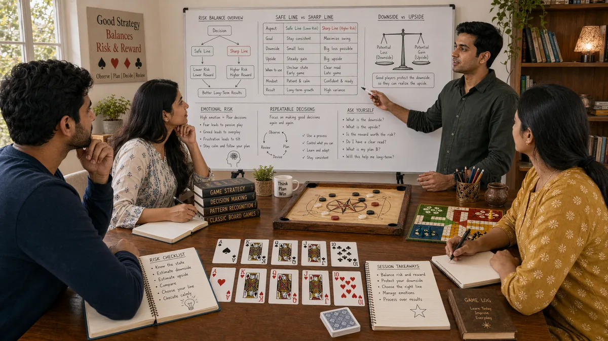

# Risk Balance in Desi Game Strategy

## 🪶 Introduction

Every decision in a strategic game involves some combination of risk and potential reward. Learning to balance these elements—taking calculated risks when the math supports them while avoiding unnecessary exposure—is one of the core skills separating skilled players from casual ones. This balance is not about being reckless or being timid; it is about making decisions that have positive expected value over time.

Risk balance shows up in every aspect of desi games: whether to call a large bet with a drawing hand in Teen Patti, when to push aggressively in Callbreak despite uncertain outcomes, and how aggressively to advance tokens in Ludo when opponents might capture them. Getting this balance right means understanding the probability of success, the size of the potential reward, and the cost of failure.

The challenge is that risk tolerance varies by situation. The same risk might be correct in one context but wrong in another, depending on stack sizes, tournament stage, opponent tendencies, and your overall objectives. Developing judgment about these situations takes experience and honest self-assessment.

---

## 🖼️ Risk Balance Overview

---

## 🎯 What Is Risk Balance?

Risk balance is the practice of evaluating whether a potential reward justifies the potential risk, and making decisions that reflect a reasonable trade-off between the two. It is not about avoiding all risk—some of the most profitable plays involve significant risk. Rather, it is about ensuring that risks are taken when the reward is sufficient and the probability of success is high enough to justify the exposure.

In practice, risk balance means understanding your probability of winning in any given situation, comparing that to the potential payout, and sizing your commitment appropriately. A 20% chance of winning 5x your bet has different math than a 50% chance of winning 1.5x. Both can be correct or incorrect depending on context, but they require different evaluations.

Risk balance also involves emotional management. The thrill of a big potential win and the fear of a likely loss can both distort judgment. Developing the discipline to evaluate risk objectively, without emotional influence, is fundamental to making consistently sound decisions.

---

# 🧠 1. Understanding Probability and Odds in Risk Decisions

Probability is the foundation of risk evaluation. You need to have a reasonable sense of how likely an outcome is before you can determine whether a risk is worth taking. In Teen Patti, this means estimating how often your hand wins against opponent ranges. In Callbreak, it means evaluating how likely a given play is to win the trick.

Odds provide another perspective on risk. Pot odds tell you what return you need to make a call profitable given the probability of winning. Implied odds consider not just the current pot but future bets you might win if you hit your draw. Understanding and using these concepts helps evaluate risk more precisely.

Developing probability sense comes from study and experience. You do not need exact calculations at the table, but you need good estimates. If a play will win more often than not against a given range, it is usually correct. If it wins less often than not, it is usually incorrect.

---

# 🧠 2. Evaluating Risk Versus Reward in Specific Situations

The core of risk balance is comparing what you can gain against what you can lose. In desi games, this comparison takes different forms. In Teen Patti, you compare the size of the pot to the size of your call. In Callbreak, you compare the value of winning the trick to the cost of losing it. In Ludo, you compare the advantage of advancing a token against the risk of it being captured.

Good risk evaluation requires seeing the situation clearly, not through the lens of what you want to happen. A risky play might feel exciting, but that excitement does not make it correct. An objectively sound risk might feel uncomfortable, but that discomfort does not make it wrong. Separating feeling from fact is essential.

The reward side of the equation includes both immediate gains and future possibilities. In Teen Patti, a bet might win the current pot and also build your reputation for future hands. In Callbreak, winning a key trick might give you momentum for subsequent rounds. These secondary effects should factor into risk evaluation.

---

# 🧠 3. Position-Based Risk Tolerance

Where you sit relative to opponents affects how much risk you can tolerate. In late position, you have more information about what others plan to do, which often means you can take more risks with less danger. In early position, you have less information, which generally means playing more conservatively.

Position affects both offensive and defensive risk. From late position, you can more easily assess whether a bluff is likely to work. From early position, you need stronger hands to justify aggressive plays. These positional effects are consistent enough to form part of your standard risk framework.

Being risk-tolerant in position does not mean being reckless. You still evaluate each situation on its merits. But when position gives you an edge, you can exploit that edge more aggressively than when you are out of position and facing more uncertainty.

---

# 🧠 4. Stack Size Influence on Risk Decisions

The chips or tokens you have available change how you should think about risk. With a large stack, you can absorb more risk and apply pressure with aggressive plays. With a short stack, you might need to take more risks just to stay in the game. These dynamics affect both your risk tolerance and how opponents view your actions.

Big stacks have the luxury of patient play. They can wait for good spots and apply pressure when the opportunity arises. They also have the ability to bluff effectively because they can back up their bets. This structural advantage means big stacks can often take more risk if they choose, though patient play is usually better.

Short stacks face different pressures. They might need to take risks that would be incorrect for bigger stacks simply to have a chance to recover. This does not mean reckless play—it means calibrated aggression aimed at doubling up or staying competitive. The risk calculations change when survival is at stake.

---

# 🧠 5. Risk Management Across Multiple Hands

Individual hand risk needs to be understood in the context of the entire session or tournament. Taking a big risk in one hand might be fine if you have many hands ahead to recover. Taking the same risk when you are close to elimination might be incorrect even if the math looks similar.

Bankroll management is a form of risk management applied across sessions. Setting limits on how much you are willing to risk in any session prevents individual sessions from affecting your overall ability to continue playing. This protective approach lets you take calculated risks without fear of catastrophic loss.

The key principle is that risk should be sized relative to your overall position. If you have many opportunities ahead, larger variance plays are more acceptable. If opportunities are limited, you might need to avoid variance even when it has positive expected value, because you cannot afford the downside.

---

# 🧠 6. Reading Opponent Risk Tolerance

Opponents have varying comfort with risk, and this affects how you should approach each game. Some players rarely take risks and can be pushed out of pots with moderate aggression. Others take risks frequently and might call with hands that have poor equity against your value range.

Assessing opponent risk tolerance involves watching how they play and noting patterns. Do they call with drawing hands or fold? Do they raise when they have strength or prefer to check? Do they play conservatively in early position or take chances? These observations build a picture of their risk preferences.

Exploiting risk tolerance means adjusting your strategy to take advantage of opponent tendencies. Against risk-averse players, you can use bluffs more often because they will fold more. Against risk-tolerant players, you can value-bet more often because they will call more. Adjusting to their tendencies multiplies your edge.

---

# 🧠 7. Avoiding Emotional Risk Decisions

Emotional states distort risk evaluation significantly. After a big loss, players often become either overly aggressive (wanting to win it back immediately) or overly cautious (afraid of losing more). After a big win, they often become overconfident and take risks they normally would not. Managing these emotional influences is critical.

The antidote to emotional risk decisions is a consistent decision process. When you follow a process that evaluates risk objectively, emotional impulses have less influence. This does not mean ignoring your feelings—it means recognizing when they might be distorting judgment and returning to the analytical framework.

Practical steps include setting pre-defined risk limits, taking breaks after emotional events, and reviewing decisions when emotional rather than focusing on outcomes. These habits prevent emotional risk-taking that erodes bankroll and confidence.

---

# 🧠 8. Balancing Aggression with Caution

Risk balance requires knowing when to press and when to pull back. Aggressive plays capture value and apply pressure, but over-aggression leads to being called by better hands or bluffed by opponents who recognize the pattern. Conservative plays preserve resources, but over-conservatism misses opportunities and lets opponents control the game.

Finding the balance means reading the situation dynamically. In some moments, the right play is to push hard and take what is available. In others, the right play is to check and let opponents make mistakes. The skill is recognizing which moment you are in and responding appropriately.

The balance shifts based on table dynamics, opponent tendencies, and your own position. Against weak opponents who fold a lot, more aggression is profitable. Against strong opponents who call appropriately, more caution is warranted. Reading these dynamics prevents either extreme.

---

## ⚠️ Common Mistakes

- **Taking risks without evaluating probability**: Acting on excitement or desperation without estimating how likely success is leads to negative expected value decisions.

- **Ignoring pot odds and implied odds**: Not calculating whether the potential reward justifies the risk based on probability and potential future gains.

- **Letting stack size influence decisions incorrectly**: Either taking too much risk when short-stacked (desperation) or playing too conservatively when big-stacked (fear).

- **Failing to consider session context**: Treating each hand in isolation rather than as part of a larger session or tournament where cumulative risk matters.

- **Overriding risk assessment with emotion**: Making decisions based on what you feel rather than what the math supports, especially after wins or losses.

- **Not adjusting risk based on opponent tendencies**: Playing the same way against all opponents regardless of their risk tolerance, missing exploitation opportunities.

---

## 🧾 Summary

Risk balance is a foundational strategic skill that involves evaluating probability and reward, managing position and stack influences, considering session context, reading opponent risk tolerance, and maintaining emotional discipline. The goal is not to avoid risk but to take calculated risks when they have positive expected value and to avoid risks that do not. This balanced approach requires both analytical ability and emotional control, both of which develop with practice and honest self-review.

---

## 🔥 SEO Keywords

risk balance strategy desi games
teen patti risk management
callbreak risk evaluation
ludo risk calculation
risk vs reward traditional games
strategic risk South Asian games

---

## Related Pages

- [Decision Making](./decision-making.md)
- [Play Styles](./play-styles.md)
- [Scenarios](./scenarios.md)

## External Reference

For a broader reference, see [related gameplay notes](https://market-lab-cmd.github.io/india-skill-gaming-hub/)