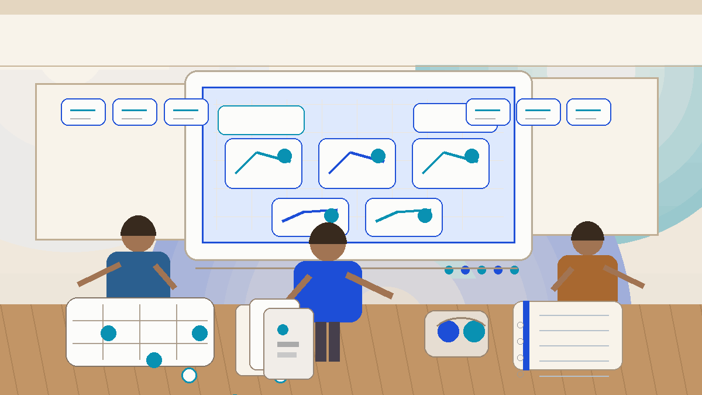

# Scenarios: Applying Strategy in Real Game Situations

## 🪶 Introduction

Theoretical knowledge of game strategy only becomes valuable when you can apply it in actual competitive situations. Scenarios bridge the gap between abstract concepts and practical decision-making, presenting the specific circumstances players encounter during real games of traditional South Asian games. By studying common scenarios and practicing appropriate responses, you develop the intuitive judgment needed to make strong decisions under pressure.

This guide explores typical strategic scenarios across desi games, providing frameworks for analyzing situations and selecting optimal responses.

---

## 🖼️ Scenario Analysis Overview

---

## 🎯 What Are Strategic Scenarios?

Strategic scenarios are specific game situations that require players to apply their knowledge and judgment to make decisions. Unlike general principles, scenarios present concrete circumstances with particular resource distributions, opponent positions, and time pressures. Understanding how to navigate these situations transforms theoretical knowledge into practical competence.

In desi games, scenarios emerge from the interaction of game mechanics, opponent behavior, and random elements. The same scenario might appear differently depending on the specific game, but the underlying strategic principles often remain consistent. By recognizing scenario patterns, you can transfer strategic knowledge across different games and contexts.

---

# 🧠 1. Opening Scenarios: Setting the Foundation

The opening phase of any game establishes the framework for all subsequent decisions. Common opening scenarios include choosing your initial position, responding to opponent first moves, and establishing resource allocation patterns. These early decisions shape the trajectory of the entire game.

In card-based games, opening scenarios involve deciding whether to pursue an aggressive start by committing resources early or a conservative start by gathering information. Your opening choice signals your strategic intentions to opponents and influences their responses.

In board games, opening scenarios center on position selection and initial resource deployment. Players who understand the strategic value of different opening positions can build lasting advantages from the very first moves.

The key to successful opening scenario management is balancing exploration with commitment. You need to experiment enough to understand the game's specific dynamics while committing sufficient resources to establish meaningful position.

---

# 🧠 2. Mid-Game Transition Scenarios

As games progress beyond the opening phase, transition scenarios emerge that require players to shift from exploration to focused strategy execution. These transitions involve committing to specific strategic approaches based on information gathered during the opening phase.

Transition scenarios often involve choosing between competing strategic directions. Should you press an early advantage or consolidate your position? Should you pursue the opponent's weakness or strengthen your own vulnerabilities? These decisions require accurate assessment of both your position and your opponent's situation.

Successful mid-game transitions depend on reading the game state correctly. Players who misread the situation often commit to strategic directions that fail to capitalize on available opportunities or expose unnecessary vulnerabilities.

---

# 🧠 3. Competitive Pressure Scenarios

Competitive pressure scenarios occur when one player actively threatens another's position or resources. These scenarios test both the aggressor's ability to maintain pressure and the defender's capacity to withstand it.

When you are applying pressure, the key questions involve commitment level and timing. How aggressively should you press the advantage? When should you shift from pressure to consolidation? Successful pressure application requires maintaining the threat without overcommitting resources.

When you are defending against pressure, the strategic considerations involve resource allocation, position strengthening, and identifying counterattack opportunities. Effective defense is not purely passive—it creates conditions for eventual counteroffensive action.

---

# 🧠 4. Resource Scarcity Scenarios

Many desi games create situations where resources become limited as the game progresses. Resource scarcity scenarios test players' ability to make difficult tradeoffs when they cannot pursue all available options.

Under resource scarcity, prioritization becomes essential. Players must identify which actions offer the greatest strategic value and commit resources accordingly. This often means accepting that some objectives will need to be abandoned in favor of higher-priority goals.

Resource scarcity also creates opportunities for creative problem-solving. Players who can find unconventional solutions to resource constraints often gain competitive advantages over opponents who rely on conventional approaches.

---

# 🧠 5. Equal Position Scenarios

Games between well-matched opponents frequently reach situations where neither side holds a clear advantage. These equal position scenarios require patience, precision, and the ability to identify subtle imbalances that can be exploited.

In equal positions, the player who makes the first mistake typically loses the advantage. Therefore, conservative play that avoids unnecessary risks often proves effective. However, excessive caution can also be detrimental, as it cedes the initiative to opponents willing to take calculated risks.

The key to navigating equal positions is maintaining strategic flexibility while actively seeking small advantages that compound over time. Look for positions that slightly improve your options or slightly restrict your opponent's—these incremental advantages often determine the outcome of closely contested games.

---

# 🧠 6. Comeback Scenarios

When a player falls behind significantly, comeback scenarios demand bold and often unconventional strategies to recover the deficit. These scenarios require players to accept higher risk levels while identifying the specific weaknesses in the leading opponent's position.

Successful comeback strategies typically involve finding the minimum viable advantage needed to shift momentum rather than attempting to eliminate the deficit in a single stroke. Incremental recovery through strategic pressure and opportunistic exploitation of opponent mistakes is more sustainable than hoping for dramatic swings.

The psychological dimension of comeback scenarios is significant. Players who maintain composure and strategic clarity while behind often outperform opponents who assume victory is assured and relax their strategic discipline.

---

# 🧠 7. Endgame Scenarios

Endgame scenarios are characterized by limited resources, high stakes for each decision, and reduced opportunities for recovery from mistakes. These scenarios require precision, calculation, and efficient resource utilization.

Common endgame scenarios include converting small advantages into victory, defending narrow leads against determined opposition, and navigating complex multi-player dynamics where different opponents have conflicting objectives. Each scenario requires specific strategic approaches calibrated to the remaining resources and time available.

Endgame competence develops through deliberate practice focused on common endgame patterns. Players who study typical endgame positions and practice solving them perform significantly better in actual competitive situations.

---

# 🧠 8. Multi-Player Dynamic Scenarios

Desi games often involve multiple players with shifting alliances and competing interests. Multi-player scenarios introduce complexity beyond two-player competition, requiring players to manage multiple relationships and strategic calculations simultaneously.

In multi-player games, the player in the lead often faces collective pressure from opponents who temporarily align to reduce their advantage. Understanding this dynamic helps leading players manage their position through strategic positioning that makes them less of a threat to each opponent individually.

Players in middle positions must balance supporting the leader against threatening opponents who are closer to victory. These calculations create rich strategic environments that reward social awareness alongside game-specific competence.

---

## ⚠️ Common Mistakes

The most common scenario error is applying generic strategic advice without considering the specific context. Not all scenarios demand the same response—each requires analysis of the particular circumstances involved. Players who rely on memorized responses rather than situational analysis struggle when encounters deviate from familiar patterns.

Another frequent mistake involves failing to recognize which scenario type you are currently in. Players who mistake a resource scarcity scenario for a competitive pressure scenario might pursue inappropriate strategies that waste valuable resources.

Players also commonly ignore the temporal dimension of scenarios, treating each situation as static rather than part of an evolving game narrative. Understanding how scenarios connect and transition is essential for maintaining strategic coherence across the entire game.

---

## 🧾 Summary

Strategic scenarios in desi games provide the practical context where theoretical knowledge becomes competitive advantage. By studying common scenarios—openings, transitions, competitive pressure, resource scarcity, equal positions, comebacks, endgames, and multi-player dynamics—you develop the pattern recognition and judgment needed to make strong decisions in real competitive situations. Practice scenario analysis regularly to strengthen your practical strategic skills.

---

## 🔥 SEO Keywords

game scenarios strategy
desi game situations
strategic decision making
Indian game tactics
gameplay scenario analysis

---

## Related Pages

- [Decision Making](./decision-making.md)
- [Pattern Recognition](./pattern-recognition.md)
- [Risk Balance](./risk-balance.md)
- [Advanced Concepts](./advanced-concepts.md)

---

## External Reference

https://market-lab-cmd.github.io/desi-game-strategy/
