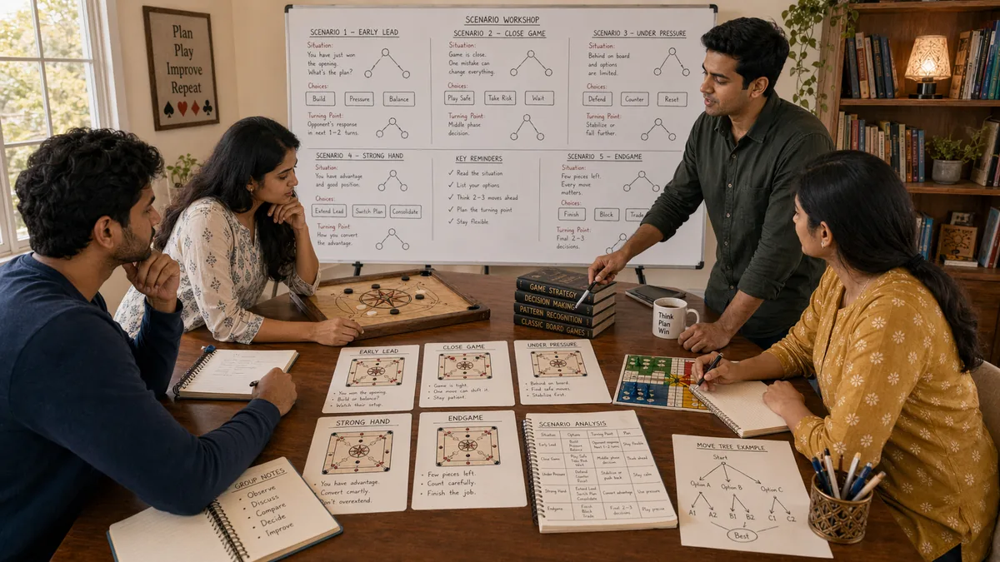

# Scenarios in Desi Game Strategy

## 🪶 Introduction

Strategy comes alive in specific scenarios—the particular combinations of game state, opponent behavior, stack sizes, and stakes that create meaningful decisions. Understanding common scenarios and how to handle them prepares you for the situations you will actually face at the table. Rather than abstract principles, scenarios present concrete choices where strategic thinking matters directly.

Traditional South Asian games like Callbreak, Teen Patti, and Ludo create recurring situations that skilled players learn to navigate systematically. Some scenarios involve protecting a lead; others involve trying to recover from behind. Some require aggressive action; others reward patience. Recognizing which scenario you are in lets you apply the right strategic approach.

This guide covers the most important scenario types you will encounter, explaining the dynamics, the typical pitfalls, and the strategic approaches that work best in each case. Use these as frameworks for your own decision-making, adjusting to the specific details of each actual game you play.

---

## 🖼️ Scenarios Overview

---

## 🎯 What Are Scenarios?

Scenarios in game strategy are specific situations that occur repeatedly and require similar strategic responses. A scenario is defined by the combination of game state, position, stack relations, opponent types, and objectives. Recognizing a scenario helps you access the right strategic framework without having to analyze every situation from scratch.

Scenarios range from common to rare. Common scenarios like facing a bet from a tight opponent occur frequently, and developing standard responses creates efficiency. Rare scenarios like being heads-up for the tournament lead in a specific structure require more deliberate analysis but still benefit from prior thinking.

The value of scenario thinking is that it lets you prepare strategically. When you know a scenario type is coming, you can think through the relevant factors in advance, which makes actual decision-making faster and more accurate. This preparation is especially valuable in high-pressure situations where clear thinking is harder.

---

# 🧠 1. Early Position Defensive Scenarios

When you are in early position with limited information about opponent holdings, defensive play is often appropriate. The challenge is that defensive play can become too tight, missing value from strong hands and giving opponents too much room to operate.

The key to early position defense is selective aggression based on hand quality and opponent tendencies. With premium hands, you can play aggressively even from early position. With marginal hands, calling or folding is often correct rather than raising without strong justification.

Early position also requires understanding your exit options. If you act and face a re-raise, will you be comfortable? If you call, will you be in a good position for later streets? These considerations affect whether early position action is appropriate given your specific situation.

---

# 🧠 2. Late Position Aggressive Scenarios

Late position provides information advantages that enable more aggressive play. You have seen what opponents do before you need to act, which reduces uncertainty and lets you exploit their weaknesses more effectively. This advantage should be used to apply pressure when opponents show vulnerability.

Aggressive play from late position includes stealing blinds, isolating weak players, and taking control of pots where opponents show uncertainty. The key is identifying which opponents are fold-worthy and which will not be pushed off hands easily. Against the latter, aggression should be calibrated differently.

Late position aggression should still be based on hand strength and opponent reads, not just position alone. A bluff from late position works better against tight opponents who fold more often. A value bet works better against loose opponents who call more often. Using position intelligently means matching your line to the specific opponent.

---

# 🧠 3. Short Stack Survival Scenarios

When your stack is short relative to the blinds or to opponent stacks, survival becomes a primary concern. You might need to take risks that would be incorrect with deeper stacks, simply to have a chance to stay competitive. This does not mean reckless play—it means calculated aggression aimed at finding spots to double.

Short stack scenarios require push-or-fold thinking in many situations. When your stack is small enough, raising all-in might be the only reasonable option because smaller raises just give opponents odds to call. In Callbreak, going all-in on high cards might be necessary to cover required tricks. In Ludo, pushing tokens forward might be the only path to scoring.

The emotional challenge in short stack scenarios is maintaining discipline despite pressure. Desperation can lead to marginal calls that are mathematically incorrect. Staying focused on expected value, even when survival is at stake, prevents making problems worse with poorly considered decisions.

---

# 🧠 4. Big Stack Dominance Scenarios

When you have a large stack relative to opponents, you have structural advantages that enable powerful strategic options. You can apply pressure, extract value, and force opponents to make difficult decisions with their limited resources. Using this advantage correctly is a major edge.

Big stack play involves selective aggression against players who cannot afford to call, taking control of pots through betting and raising, and building situations where your stack makes opponents' decisions very expensive. The goal is to use your resources to create folds and win pots without showdowns whenever possible.

The risk of big stack play is over-aggression. Even with a large stack, you can lose chips to better hands or betterstrategic play. Using your stack advantage does not mean ignoring opponent quality or situation analysis. The goal is exploiting your edge without giving it back through carelessness.

---

# 🧠 5. Bubble and ICM Scenarios

In tournament structures, the bubble—the point where one more elimination puts players in the money—creates specific strategic pressures. Players near the bubble often play very tight to avoid elimination, which changes the value of hands and situations significantly.

ICM (Independent Chip Model) considerations affect correct strategy at the bubble and in similar critical moments. Your chips have different value than they did earlier in the tournament because they determine actual payouts, not just future tournament equity. This changes the math of risk versus reward in ways that might make folding correct even when you have positive expected value in chip terms.

Bubble scenarios require balancing survival with opportunity. If you can survive into the money without significant risk, that is often correct even if you give up some equity. If you can apply pressure on opponents who are playing too tight because they are scared of elimination, that creates profitable spots.

---

# 🧠 6. Heads-Up Critical Scenarios

When only two players remain in contention, the strategic dynamics change significantly. You are playing against one opponent, which means you can focus on their specific tendencies and adjust more precisely than in multi-way pots. Heads-up play often determines final outcomes in tournaments and matches.

Heeds-up scenarios require both players to be willing to take aggressive actions because there is less room for passive play when only two players share the pot. This creates more complex dynamics where betting, bluffing, and hand reading all become more important.

Heads-up skill involves reading one specific opponent intensely, adjusting to their tendencies, and finding the right balance between value and bluffing. Because you see every action they take, you can develop a very detailed profile, which both enables exploitation and creates the risk that they will do the same to you.

---

# 🧠 7. Comeback and Recovery Scenarios

When you are significantly behind, recovery requires either a strategy change or a sustained period of better play. The temptation is to take big risks to catch up quickly, but this often creates more problems than it solves. Recovery usually requires patience combined with selective aggression.

Recovering from behind means finding spots where you have genuine edge and maximizing those situations while avoiding unnecessary variance in others. The goal is to close the gap gradually rather than trying to do it all at once, which usually ends in disaster.

The emotional component of comeback scenarios is significant. Falling behind creates frustration and pressure that push toward bad decisions. Maintaining discipline and process despite being behind is one of the harder skills to develop, but it is essential for anyone who plays regularly.

---

# 🧠 8. Multi-Way Complex Scenarios

When multiple players are in the pot, strategic complexity increases because you must consider multiple opponent ranges and potential interactions between them. Multi-way pots require different calculations than heads-up pots, with position, hand strength, and opponent tendencies all interacting differently.

Multi-way scenarios often reward tight play because the likelihood that someone has a strong hand increases with more players. Aggressive plays might work less often because more players means a higher chance someone has a real holding. Value betting might be more profitable if you have a genuine advantage.

Position becomes especially important in multi-way pots because you can see how multiple opponents act before you need to decide. Late position lets you assess strength and make accurate decisions. Early position in multi-way pots is more difficult because you lack information about what others will do.

---

## ⚠️ Common Mistakes

- **Treating all scenarios the same way**: Each scenario type has specific dynamics that require specific strategic responses. Using the wrong approach leads to suboptimal results.

- **Playing too tight in early position**: Missing value from strong hands by being overly defensive when some aggression would be correct.

- **Being too aggressive with big stacks**: Over-playing position advantage and stack strength, leading to losses against better players who exploit this.

- **Panic play when short-stacked**: Making desperate calls or all-in moves without proper evaluation of expected value.

- **Ignoring ICM at bubble**: Treating tournament chips as if they have constant value, which leads to incorrect risk calculations in critical moments.

- **Failing to adjust to heads-up dynamics**: Playing multi-way strategy against a single opponent, missing exploitation opportunities and creating exploitable patterns.

---

## 🧾 Summary

Scenario-based thinking helps you apply strategic principles to actual game situations. The key scenario types—early position defense, late position aggression, short stack survival, big stack dominance, bubble play, heads-up confrontation, comeback situations, and multi-way complexity—each require different approaches and create different challenges. Recognizing which scenario you are in lets you access the right framework and make better decisions faster. Practice identifying scenarios in your games and applying the appropriate strategic approach to each.

---

## 🔥 SEO Keywords

game scenarios desi strategy
teen patti scenario types
callbreak situation strategy
ludo game scenarios
tournament scenarios South Asian games
strategic situation analysis

---

## Related Pages

- [Risk Balance](./risk-balance.md)
- [Decision Making](./decision-making.md)
- [Advanced Concepts](./advanced-concepts.md)

## External Reference

For a broader reference, see [related gameplay notes](https://market-lab-cmd.github.io/india-skill-gaming-hub/)