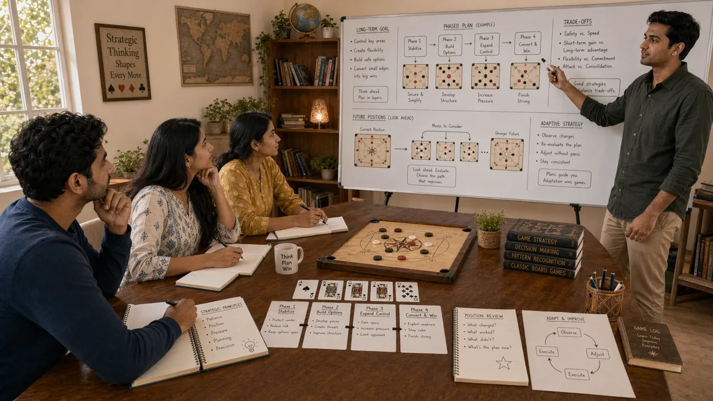

# Strategic Thinking in Desi Game Strategy

## 🪶 Introduction

Strategic thinking is the capacity to see beyond the immediate moment and understand how current decisions affect future possibilities. It is the difference between playing reactively—responding to whatever happens next—and playing proactively—shaping the game toward outcomes you want. This higher-level thinking separates players who consistently succeed from those who win occasionally but struggle to improve.

Strategic thinking in desi games involves multi-step planning, understanding how different parts of the game interact, and maintaining focus on long-term objectives even when immediate pressures tug in different directions. It requires patience and discipline because strategic moves often delay gratification, winning in ways that feel indirect but are ultimately more effective.

This guide covers the mental framework and practical skills that constitute strategic thinking in traditional South Asian games. These principles apply across different games and variations, giving you a thinking apparatus that improves play in Callbreak, Teen Patti, Ludo, and other traditional games.

---

## 🖼️ Strategic Thinking Overview

---

## 🎯 What Is Strategic Thinking?

Strategic thinking is the practice of considering how current decisions interact with future possibilities and aligning actions toward long-term objectives. It is broader than tactics, which focus on winning the current hand or round. Strategy considers how the current hand fits into the larger game, the session, or the tournament.

Strategic thinking involves maintaining multiple timeframes in mind simultaneously. You are thinking about what happens in the next round, what happens in the middle rounds, and what the game looks like near the end. These different timeframes influence current decisions in ways that purely tactical thinking misses.

A key component of strategic thinking is understanding trade-offs. Most strategic decisions involve trading one thing for another—trading short-term risk for long-term reward, trading immediate chip preservation for future opportunity. Recognizing and accepting these trade-offs is part of mature strategic thinking.

---

# 🧠 1. Multi-Round Planning and Future State Visualization

Strategic thinking requires imagining possible future states and evaluating how current decisions lead toward or away from favorable outcomes. In Callbreak, this means planning which tricks to win and which to let opponents take, understanding how current card usage affects future rounds. In Ludo, it means seeing how moving one token affects the safety and opportunity of others in subsequent turns.

Future state visualization is a learnable skill. You build it by asking questions like "if I make this move, what does the board look like in two rounds?" "If my opponent responds in the strongest way, where does that leave me?" "What options will I have if I take this action versus another?" These questions build the mental muscle of seeing ahead.

The skill improves with practice. Reviewing past hands and analyzing how the game unfolded from different decision points builds intuition for future state visualization. Players who do this deliberately see further ahead than those who do not.

---

# 🧠 2. Long-Term Objective Alignment

Strategic thinking aligns current decisions with long-term objectives. In a tournament, the objective might be to finish in the top places. In a cash game, the objective might be steady profitability over many sessions. In a casual match, the objective might be competitive play with friends. Different objectives might require different strategic approaches.

Long-term objective alignment means resisting short-term temptations that work against your goals. If your objective is to finish in the money in a tournament, making a high-variance play that threatens elimination might be strategically wrong even if it has positive expected value in chip terms. The risk does not fit the objective.

Clarifying your objectives before playing helps maintain this alignment. When you know what you are playing for, you can make decisions that support those goals rather than being distracted by immediate outcomes that do not serve you.

---

# 🧠 3. Understanding Game Theory Basics

Game theory provides a framework for understanding optimal strategic interaction between players who have conflicting interests. Even in games with incomplete information, game theory concepts help you reason about what strategies are sensible and how opponents might respond.

A key game theory concept is equilibrium—strategies that no player can improve by unilaterally changing their approach. In some situations, playing a balanced strategy that includes both value hands and bluffs is optimal because it prevents opponents from exploiting you. In other situations, exploiting specific opponent weaknesses is better than equilibrium play.

Understanding game theory does not mean playing mechanically according to formulas. It means having a framework for thinking about strategic interaction that guides your decisions when facing incomplete information and intelligent opposition.

---

# 🧠 4. Exploitative vs. Balanced Strategic Approaches

Strategic thinking requires choosing between exploiting opponent weaknesses and maintaining balanced play that does not give too much away. These approaches suit different situations, and knowing which to use is itself a strategic skill.

Exploitative play targets specific opponent weaknesses. If an opponent folds too often to bets, you can bluff more. If they call too often, you can value bet more. This approach extracts maximum profit from specific opponents but risks being exploited if they adjust.

Balanced play maintains a strategy that is difficult to exploit regardless of what opponents do. This approach is safer when opponent quality is high or when you lack clear information about their tendencies. It sacrifices some potential profit for protection against counter-exploitation.

Good strategic players choose between these approaches based on situation. Against weak opponents or those who are not adjusting, exploitation is highly profitable. Against strong opponents who will notice and exploit patterns, balance is safer.

---

# 🧠 5. Understanding and Creating Strategic Leverage

Strategic leverage exists when you can force opponents to make difficult decisions that they are likely to get wrong. This might come from position, from chip stack, from hand strength, or from a combination of factors. Recognizing leverage opportunities and creating them is an advanced strategic skill.

Leverage in Teen Patti might come from having position on an opponent while representing a strong hand. In Callbreak, leverage might come from controlling the board in a way that forces opponents to play cards that expose their weakness. In Ludo, leverage might come from controlling key squares that force opponents to take unfavorable paths.

Creating leverage often involves setting up situations rather than taking immediate action. A strategic bet or move might be designed to create leverage for subsequent rounds rather than to win the current pot. This patient, setup-oriented approach characterizes advanced strategic thinking.

---

# 🧠 6. Adapting Strategy to Changing Conditions

Strategic thinking recognizes that conditions change and requires ongoing adjustment. What worked in the early game might be wrong in late stages. What exploited one opponent might not work against another who has noticed. Flexibility and adaptation are core strategic thinking skills.

Adaptation starts with observation. When conditions change—opponents adjust their play, tournament structure shifts blinds, your stack changes relative to others—you need to recognize these changes and respond. Failing to adapt means using outdated strategic frameworks that no longer fit the actual situation.

Adaptation should be thoughtful rather than reactive. Simply doing the opposite of what you were doing might not be correct. You need to analyze what changed, why it changed, and what new approach fits the new conditions. This analytical adaptation is part of mature strategic thinking.

---

# 🧠 7. Strategic Patience and Timing

Strategic thinking requires patience because the best opportunities do not always coincide with your immediate position. Sometimes waiting for the right spot, even if it means passing on profitable-looking options, produces better long-term results. Timing is a crucial component of strategic execution.

Patience manifests in different ways. In Callbreak, it might mean conserving strong cards for critical moments rather than using them early. In Teen Patti, it might mean waiting for premium hands rather than playing every pot. In Ludo, it might mean planning sequences that take multiple turns to execute.

Timing involves recognizing when conditions are right for specific actions. A bluff works better at certain times than others. A value bet extracts more in some situations than others. Strategic players develop sense for when the moment is right and act decisively when it is.

---

# 🧠 8. Developing Strategic Vision

Strategic vision is the ability to see the game as a whole and understand how different elements interact toward outcomes. Players with strong strategic vision can look at a game state and immediately see which player has the upper hand, what paths exist for different players, and what key decision points are likely to arise.

Developing strategic vision comes from experience and deliberate reflection on play. Reviewing past games and analyzing how different decisions affected outcomes builds the pattern recognition that creates vision. Watching stronger players and analyzing their choices also accelerates development.

Strategic vision lets you prioritize decisions that matter most and avoid spending mental energy on situations where the outcome is less important. This prioritization is a hallmark of advanced strategic thinking and contributes significantly to consistency of performance.

---

## ⚠️ Common Mistakes

- **Focusing only on immediate outcomes**: Making decisions that solve the current moment but create problems later, lacking multi-round planning perspective.

- **Confusing tactics with strategy**: Winning a hand or round without thinking about how it affects the larger game, which can be strategically wrong.

- **Playing the same way regardless of conditions**: Failing to adapt strategy to changing opponents, stacks, or tournament stages, which leads to suboptimal outcomes.

- **Neglecting game theory fundamentals**: Making decisions that are exploitable by anyone who understands basic strategic interaction, especially in heads-up situations.

- **Forcing action when patience is better**: Taking action because it feels like something needs to happen, rather than waiting for genuinely advantageous spots.

- **Ignoring opponent adjustments**: Not noticing when opponents change their strategy and continuing to exploit patterns that no longer exist.

---

## 🧾 Summary

Strategic thinking encompasses multi-round planning, long-term objective alignment, game theory understanding, balanced versus exploitative play, leverage creation, adaptation to changing conditions, strategic patience, and vision development. These skills work together to create a higher-level perspective that improves decision quality across all desi games. Developing strategic thinking takes time and deliberate practice, but it provides a foundation for consistent improvement that tactical approaches cannot match.

---

## 🔥 SEO Keywords

strategic thinking desi games
teen patti strategy planning
callbreak advanced thinking
ludo strategic vision
game theory South Asian games
multi-round planning strategy

---

## Related Pages

- [Advanced Concepts](./advanced-concepts.md)
- [Decision Making](./decision-making.md)
- [Fundamentals](./fundamentals.md)

## External Reference

For a broader reference, see [related gameplay notes](https://market-lab-cmd.github.io/india-skill-gaming-hub/)